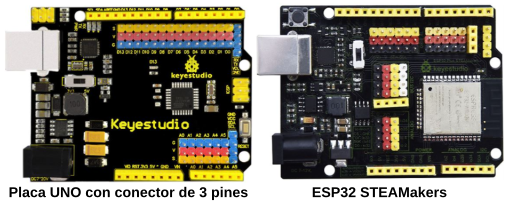
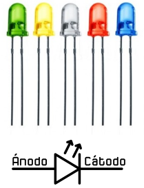
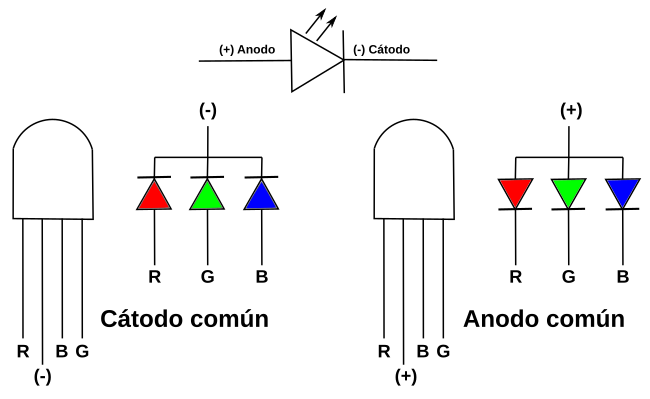
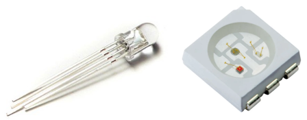
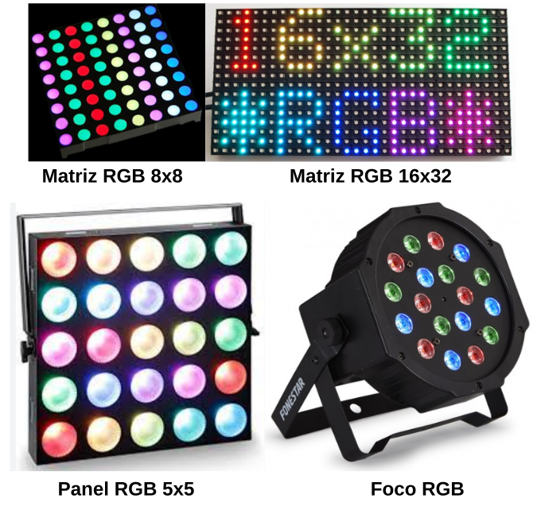
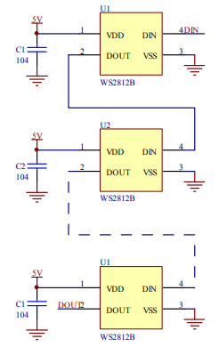
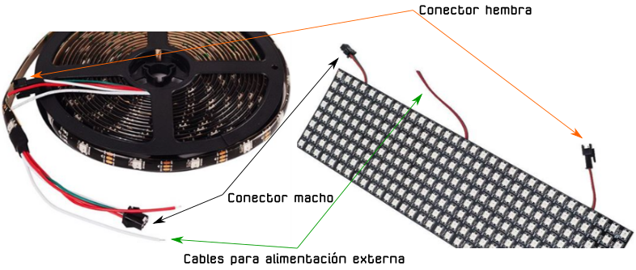
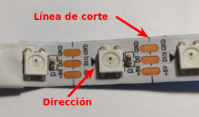

# Tiras y matrices de LEDs
Básicamente vamos a dar unas notas sobre algunos de estos elementos. El tema será tratado tanto desde el entorno gráfico de ArduinoBlocks como desde el IDE de Arduino. Las placas controladoras que más utilizaré son las de las figuras siguientes, o similares.

*Placa tipo que se utilizan*

## **Diodo LED**
El diodo LED (Light Emitting Diode) es un diodo semiconductor capaz de emitir luz cuando se polariza directamente, lo mas usuales dentro del espectro visible aunque también pueden ser de infrarrojos, laser, etc. Su uso mas habitual es como indicador y, últimamente cada vez mas frecuentes en iluminación. Sus principales ventajas frente a luces incandescentes son:

* Menor consumo de energía
* Mayor vida útil
* Menor tamaño
* Gran durabilidad y fiabilidad

En la figura siguiente vemos el aspecto físico que tiene y su símbolo electrónico.

*Aspecto y símbolo del LED*

El color de la cápsula es simplemente orientativo de la longitud de onda que define realmente el color de la luz emitida. Por ello el LED con la cápsula transparente puede emitir en cualquiera de los colores del espectro visible.

El LED es un dispositivo que tiene polaridad siendo su comportamiento el siguiente: En polarización directa (ánodo a positivo y cátodo a negativo) el LED emite luz y en polarización inversa (ánodo negativo y cátodo positivo) se comporta prácticamente como un interruptor abierto.

Para su correcto funcionamiento el diodo LED se polariza poniéndole en serie una resistencia que limita la corriente que pasa a través del mismo y, por tanto, determina el nivel de brillo de la luz emitida.

Sin entrar en detalles en la tabla siguiente se dan los valores de tensión directa (VF) y corriente directa (IF) para los colores mas habituales de LEDs. A partir de estos valores y el valor de tensión de alimentación de nuestro LED podemos calcular el valor de la resistencia serie sin mas que aplicar la formula indicada.

*Tensión y corriente para distintos colores*

## **Matriz de 8x8 LEDs**
Es una pantalla o distribución de 8x8 LEDs en la que podemos programar diferentes símbolos o elementos, como: caras, iconos, letras... Hay opciones prediseñadas desde ArduinoBlocks y también, existe la opción de crearlos personalizados. Se trata de dispositivos I2C y su aspecto, cuando no podemos cambiar su dirección física, es el de la figura siguiente.

*Aspecto de la matriz de 8x8*

Este tipo de matrices son 'multiplexadas', por lo que para controlar 64 LED necesitamos 16 pines y eso son muchos pines aunque hay chips de controladores como el MAX7219 que pueden controlar una matriz, pero aún así hay mucho cableado que configurar y ocupan muchos pines. Para solucionar esto se utiliza un chip de control que tiene un reloj incorporado para multiplexar la pantalla. Además del módulo utiliza una fuente de corriente constante que permite obtener un color uniforme y brillante de todos los diodos. El conjunto forma una matriz de 8x8 que se controla a través de una interfaz I2C.

Sus principales características son:

* Matriz de LEDs de 8 filas y 8 columnas
* Direccionada por un chip HT16K33
* Conexión tipo I2C
* Tensión de alimentación: 5V
* Frecuencia de trabajo: 400KHz
* Potencia de entrada: 2.5W
* Corriente de entrada: 500mA

También existen matrices que son direccionables , como la que vemos en la imagen siguiente:

*Aspecto de la matriz de 8x8 direccionable*

## **LED RGB y matrices RGB**
Un LED RGB es en realidad un encapsulado que incorpora tled rgbres diodos LED, uno por cada color fundamental. Los colores primarios en óptica son el rojo, el verde y el azul y la correcta combinación, en términos de intensidad, de ellos originará cualquiera de los colores secundarios. Las siglas RGB son el acrónimo de Red, Green y Blue. En la imagen siguiente vemos el modelo aditivo de los colores rojo, verde y azul.

*Colores RGB*

Teóricamente en Arduino, cada uno de esos LEDs podría adoptar 256 (valores entre 0 y 255) colores diferentes, es decir, un total de 16.777.216 posibles colores diferentes con un LED RGB.

El símbolo y la representación mas comunes de este componente lo vemos en la imagen siguiente:

*Símbolo y representación LED RGB*

El aspecto del componente en sus versiones inserción y SMD lo vemos en la imagen siguiente:

*Aspecto LED RGB*

Estos LEDs se pueden agrupar en forma de matrices de diferentes números de LEDs ordenados por filas y columnas.  En la figura siguiente vemos una muestra de este tipo de matrices.

*Matrices de LED RGB*

La fila inferior corresponde a elemento normalmente utilizados en iluminación profesional y espectáculos que se controlan mediante dispositivos DMX y que suelen tener potencias elevadas.

## **LED RGB direccionable**
Comúnmente se les conoce como Neopixel, que es una marca registrada por [Adafruit Industries](https://www.adafruit.com/). Cada LED que componen la tira o matriz tiene los siguientes cuatro pines:

* Alimentación VDD: 5V
* Tierra: GND
* DI (Date Input): pin para recibir información
* DO (Date Output): pin para enviar inforamción

Cada uno de los LEDs es direccionable de manera individual gracias al circuito electrónico que incluyen que es un circuito lógico con una memoria de un byte por color. Los tipos mas comunes son el SK6812, WS2811 o, el mas habitual de todos, el WS2812 cuyo [datasheet](./datasheet/WS2812.pdf) tenemos en el enlace.

El WS2812B incluye un oscilador interno de precisión y un circuito de control de corriente constante programable de 12 V, lo que garantiza de manera efectiva que la intensidad del color sea consistente. El protocolo de transferencia de datos utiliza un único modo de comunicación de multiplexado NZR.

En la figura siguiente vemos el aspecto de un diodo LED RGB individual en formato inserción y SMD.

*Aspecto de un diodo LED RGB direccionable*

### **Aspectos previos**
Para transmitir información digital esta se debe sincronizar mediante una convención especial, la codificación. Dos dispositivos llevan una comunicación por cable convirtiendo la información a transmitir en un flujo de bits (0 y 1) o "Dates" que se suele nombrar con la letra D y que va acompañada de una señal de reloj para sincronizar las transmisiones. La forma convencional de transmisión digital se componen de una línea de datos mas una línea de reloj. Ahora bien, cualquier ligera desviación en la longitud de estas líneas hará que el receptor no cumpla con el tiempo de establecimiento del muestreo de datos, originando errores en los datos. La forma de asegurar que esas líneas son idénticas es que sean la misma línea, lo que hace que aparezcan códigos que fusionan los datos y el reloj, entre los que están los código RZ, NRZ y NRZI que vamos a ver someramente a continuación.

* **Codificación RZ**. El acrónimo de de "Return Zero" o retorno cero y su característica es que se transmiten bits de datos dentro de cada periodo de la señal. En la figura siguiente los datos se representan en rojo y vemos que ocupan una parte del periodo T, siendo y matrices RGBcero el resto del tiempo. Este sistema se denomina RZ unipolar o retorno a cero unipolar y como se observa en la figura un nivel bajo indica 0 y un nivel positivo indica 1.

*Código RZ unipolar*

El código de retorno a cero se divide en un código de retorno a cero unipolar y un código de retorno a cero bipolar en el que el nivel alto indica 1 y el nivel negativo o, tal y como vemos en la figura siguiente:

*Código RZ bipolar*

* **Codificación NRZ**. El acrónimo es de "Not Return Zero" o código sin retorno a cero y se diferencia del RZ en que no necesita retornar a cero. En la figura siguiente vemos gráficamente el código.

*Código NRZ*

En el datasheet estos código se denominan T0H y T0L.

El funcionamiento de una agrupación en cascada como la de la figura siguiente se puede resumir diciendo que: el circuito integrado de cada LED puede almacenar 3 bytes (24 bits), un byte para cada color. Solo el primer LED está conectado al Pin de control, en este caso, un pin digital de nuestra placa, que enviará la cadena de todos los colores según el número de pixeles que estén conectados y a su vez el primer LED recibirá la información de todos los colores uno tras otro. La información se transmite de un LED a otro porque cuando un LED recibe 3 bytes nuevos de información entrega al siguiente LED los 3 bytes que contenía anteriormente, de esta manera cuando la placa con el programa termina de mandar todos los colores por el pin de datos el primer LED habría recibido y enviado todos los colores para quedarse finalmente con el color que le corresponde y así el resto de LEDs. De esta forma una tira de LEDs RGB direccionables es un dispositivo digital de salida, es decir su funcionamiento consiste en recibir la información del color a mostrar y mostrarlo.digital de salida, es decir su funcionamiento consiste en recibir la información del color a mostrar y mostrarlo.

*Conexión en cascada*

### **Aspectos técnicos**
Los LEDs RGB direccionables se suelen suministrar en tiras de diferentes longitudes y con distinto número de LEDs y a veces se dispone la tira en forma de matriz. En la figura siguiente vemos el aspecto de algunos tipos.

*Tira y matriz de LEDs RGB*

Tienen 3 cables asociados a un conector y dos cables extra para añadir alimentación externa cuando es necesario porque la placa de control no entrega suficiente corriente para alimentar al conjunto. Cuando se trabaja con una tira de pocos LEDs no es necesario añadir esta alimentación externa, ya que placas como Arduino UNO o la ESP32 STEAMakers pueden suministrar la corriente que necesitan.

En la figura siguiente vemos una tira de 8 LEDs:

*Tira de ocho LEDs RGB*

Cualquier tira de LEDs RGB (sea cual sea su disposición en línea, como matriz, etc) debe utilizarse siempre en la dirección que marca el terminal hembra como entrada y el conector macho como salida. Las podemos ir conectando entre sí pero siempre respetando este sentido de la tira. Junto a cada led RGB está indicada la dirección de la tira mediante un triángulo y también a qué pin debe ir conectado cada cable. Vemos +5V que corresponde a Vcc, GND, y en medio que pone Din o D0 que corresponde al pin digital de entrada de datos que debemos conectar al pin de salida de la placa de control.

También las podemos cortar por cualquiera de las líneas existentes entre cada uno de los LEDs y que está marcado con la línea de corte. El corte debe hacerse dejando la mitad del pad de cobre a un lado y otro de la línea y así poder unir después entre ellas con conectores especializados o soldándolas.

*Dirección y línea de corte*

