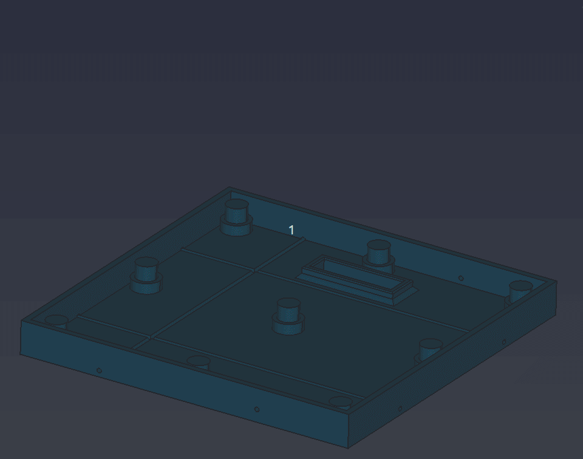
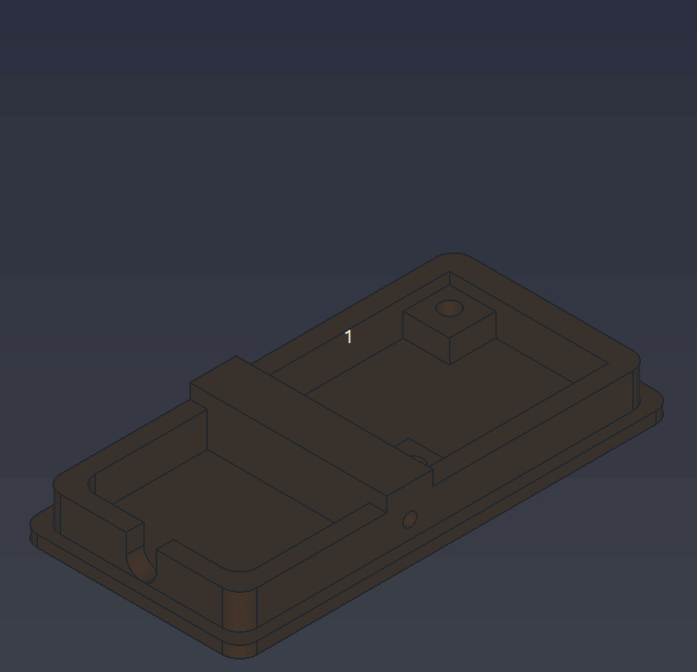

# Archivos para impresión 3D
El diseño de las cajas para soporte de los elementos están inspirados en los siguientes modelos:

* **Caja para la matriz de 16x16**

    - De [Printables](https://www.printables.com/es), el modelo 3D [LED Matrix 16x16 - ESP8266 / Arduino - NeoPixel / WS2812b](https://www.printables.com/es/model/73464-led-matrix-16x16-esp8266-arduino-neopixel-ws2812b/user-gcodes).
    - En [Thingiverse](https://www.thingiverse.com/) tenemos el mismo modelo [LED Matrix 16x16 - ESP8266 / Arduino - NeoPixel / WS2812b](https://www.thingiverse.com/thing:4928867)

* **Caja para el jpoystick**

    - En [Thingiverse](https://www.thingiverse.com/) tenemos el modelo [Box for joystick module Arduino Elegoo](https://www.thingiverse.com/thing:4600292/files)

A continuación tenemos el listado de archivos .stl junto con su descripción.

| **Archivo** | **Descripción** |
|---|---|
|[Base matriz](../3D/stl/serpiente-Base-caja-matriz.stl)| Base principal para el resto de elementos 3D de la matriz de LEDs de 16x16|
|[Soporte](../3D/stl/serpiente-soporte-interior.stl)| Elemento de separación para alojar cables y componentes y servir de soporte a la matriz|
|[Rejilla](../3D/stl/serpiente-Rejilla-4.stl)| Una rejilla de 16x16 que separa los LEDs unos de otros|
|[Tapa](../3D/stl/serpiente-tapa-m.stl)| La tapadera del conjunto de elementos anteriores|
|[Base joystick](../3D/stl/serpiente-Base-Joystick.stl)| Soporte para alojar el dispositivo junto al cable de conexión|
|[Caja jpystick](../3D/stl/serpiente-Caja-joystick.stl)| Elemento de cierre de la base|
|[Flechas](../3D/stl/serpiente-Flechas.stl)| Elemento decorativo indicativo de la dirección del movimiento. La 'C' del centro indica que con el pulsador se puede cambiar el color de la serpiente|

En la animación siguiente vemos el aspecto de estos elementos y la secuencia de montaje de los mismos.

*Partes de la caja de la rejilla*

En la siguiente tenemos lo mismo pero para el joystick.

*Partes de la caja del joystick*

