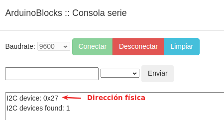
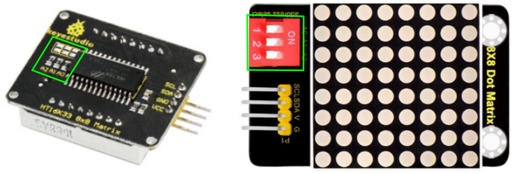

# Matrices de 8x8 LEDs
Fundamentalmente, aunque su aspecto exterior es idéntico, vamos a distinguir dos tipos:

* Matriz de 8x8 LEDs sin controlador
* Matrices I2C controladas por el chip HT16K33 como las que se contemplan en ArduinoBlocks.
* Matrices controladas por el chip MAX7219 o MAX7221 que se controlan con la librería [MD_MAX72xx](https://majicdesigns.github.io/MD_MAX72XX/)

## **Matriz de 8x8 LEDs**
Se trata simplemente de diodos LED dispuestos en forma de matriz de 8x8 en los que se han unido por filas todos los cátodos o todos los ánodos de los diodos y se ha hecho lo propio con la otra patilla de cada columna. Esto da lugar a los dos tipos posibles de matrices, de ánodo común o de cátodo común. En la figura siguiente vemos el aspecto externo de estos elementos y los diagramas de conexión interna de cada tipo.

*Aspecto y diagramas de conexión interna*

La más común dentro del mundo Arduino es la de cátodo común para excitar los pines con niveles altos.

En total una matriz de este tipo dispone de 16 patillas para controlar los 64 LEDs por lo que es evidente que no se pueden controlar los diodos como si fueran independientes ya que solamente disponemos de pines que se corresponde con filas y columnas.

Para mostrar un gráfico o letra en la matriz lo que en realidad hay que hacer es componer ese gráfico por columnas y hacer un recorrido de todos los necesarios como para que la percepción visual nos haga creer que estamos viendo ese gráfico o texto.

Utilizar la matriz de esta forma se antoja complejo y además son necesarios muchas patillas de la placa de control, por no hablar de que además se requiere de una resistencia en cada fila para limitar la corriente por los LEDs.

Para evitar esta complejidad se utilizan circuitos integrados especializados en el control de LEDs como el [HT16K33](https://cdn-shop.adafruit.com/datasheets/ht16K33v110.pdf) o el [MAX7219](https://www.analog.com/media/en/technical-documentation/data-sheets/max7219-max7221.pdf) de los que tenemos su hojas de datos en los enlaces anteriores.

## **Matriz de 8x8 LEDs I2C**
Basada en el circuito HT16K33 que es un controlador de LED multifunción. El números de segmentos de visualización en el dispositivo es 128. El HT16K33 es compatible con la mayoría de los microcontroladores y se comunica a través de un bus I2C bidireccional de dos líneas. El chip de control tiene un reloj incorporado para multiplexar la pantalla. Además el módulo utiliza una fuente de corriente constante que permite obtener un color uniforme y brillante de todos los diodos. El aspecto del dispositivo visto por ambas caras es el de la figura siguiente:

*Aspecto de la matriz I2C de 8x8*

Sus principales características son:

* Matriz de LEDs de 8 filas y 8 columnas
* Direccionada por un chip HT16K33
* Conexión tipo I2C
* Tensión de alimentación: 5V
* Frecuencia de trabajo: 400KHz
* Potencia de entrada: 2.5W
* Corriente de entrada: 500mA

### Las comunicaciones I2C
El bus conocido por las siglas I2C, IIC o I²C (del inglés Inter-Integrated Circuit = Circuito inter-integrado), es un bus serie de datos desarrollado en 1982 por Philips Semiconductors (hoy NXP Semiconductors, parte de Qualcomm). Se utiliza principalmente internamente para la comunicación entre diferentes partes de un circuito, por ejemplo, entre un controlador y circuitos periféricos integrados. Posteriormente fue adoptado progresivamente por otros fabricantes hasta convertirse en un estándar del mercado con miles de circuitos integrados de diferentes fabricantes.

I2C también se denomina TWI (Two Wired Interface) únicamente por motivos de licencia, denominación introducida por Atmel. No obstante, la patente caducó en 2006, por lo que actualmente no hay restricción sobre el uso del término I2C.

El bus I2C requiere únicamente dos cables o lineas de señal para su funcionamiento, uno para la señal de reloj (SCL, Serial Clock) y otro para el envío de datos (SDA, Serial Data). Ambas líneas precisan resistencias de pull-up hacia Vcc. Cualquier dispositivo conectado a estas líneas es de drenador o colector abierto (Open Collector), lo cual en combinación con las resistencias pull-up, crea un circuito Wired-AND. En la figura siguiente vemos el diagrama básico de conexionado del bus con algunos ejemplos de dispositivos. La señal de reloj siempre es generada por el circuito que actúa como Master.

*Diagrama de conexión del bus I2C*

Para ser reconocido en el bus, cada dispositivo dispone de una dirección, que se emplea para acceder a cada uno de ellos de forma individual. Esta dirección puede ser fijada por hardware, en cuyo caso se pueden modificar los últimos 3 bits mediante “jumpers” o microinterruptores (ejemplo de la matriz de 8x8), o por software.

En general, cada dispositivo conectado al bus debe tener una dirección única. Si tenemos varios dispositivos similares tendremos que cambiar la dirección o, en caso de no ser posible, implementar un bus secundario.

El bus I2C tiene una arquitectura de tipo master-slave, lo que indica que el master es el encargado de controlar al resto de dispositivos tipo slave con los que se comunica y que se comunican con el, teniendo siempre el marte prioridad absoluta. El dispositivo master es el que inicia la comunicación con los slaves. Los slaves no pueden iniciar la comunicación (el master tiene que preguntarles), ni hablar entre si directamente.

El bus I2C debe ser por lo tanto síncrono, es decir debe existir una señal de reloj que controle las comunicaciones. Es el master el que proporciona la señal de reloj, que mantiene sincronizados a todos los dispositivos del bus. De esta forma, se elimina la necesidad de que cada dispositivo tenga su propio reloj, de tener que acordar una velocidad de transmisión y mecanismos para mantener la transmisión sincronizada como en UART o SPI. En la figura vemos un cronograma ejemplo del funcionamiento del sistema.

*Cronograma trabajo bus I2C*

El protocolo de comunicación I2C sigue la siguiente secuencia:

* Primero, el master genera la señal de reloj del bus (SCL).
* Se inicia la comunicación por orden del master al establecer la condición de START, que se produce cuando SDA pasa de uno a cero y se mantiene en cero durante un tiempo.
* El master direcciona a los slaves.
* El master indica si se va a leer o escribir.
* El slave direccionado responde con una señal de conformidad ACK (acknowledge).
* Se transmite los datos byte a byte desde SDA al receptor. Por cada pulso desde SCL se transmite un bit de información.
* El destinatario de la información responde con una señal de conformidad ACK.
* Se acaba la comunicación cuando el master establece la condición de STOP, que se produce cuando SDA, por orden del master pasa de cero a uno y se mantiene en uno durante un tiempo.

Son muchos los dispositivos I2C que se pueden direccionar por este bus I2C, siendo lo más común en los dispositivos para I2C que utilicen direcciones de 7 bits, aunque existen dispositivos de 10 bits, pero es un caso raro. Una dirección de 7 bits implica que se pueden poner hasta 128 dispositivos sobre un bus I2C. Hemos visto que las direcciones son de 8 bits y esto es porque el bit extra de los 7 de la dirección lo emplea el master para informar al slave si va a leer o escribir. Si el bit de lectura/escritura es cero, el dispositivo master está escribiendo en el slave. Si el bit es 1 el master está leyendo desde el slave. La dirección de 7 bit se coloca en los 7 bits más significativos del byte y el bit de lectura/escritura es el bit menos significativo.

### Escanear dispositivos I2C
Si no conocemos la dirección especifica de nuestro módulo podemos utilizar un pequeño programa que llamaremos Escaner-I2C y que se encargará de identificar la dirección I2C y todos los dispositivos I2C conectados a nuestra placa. Debemos crear un proyecto, en esta ocasión, de tipo "Arduino UNO" para tener disponible el menú I2C que nos de acceso al bloque "Escanear dispositivos I2C..." tal y como vemos en la figura siguiente:

*Menu I2C*

Un sencillo programa como el de la figura siguiente nos permite ver los dispositivos I2C conectados y su dirección física asociada.

*Programa Escaner-I2C*

El resultado de tener conectada una LCD I2C al puerto lo vemos en la figura siguiente:

*Consola para el programa Escaner-I2C*

### Cambiar la dirección física del dispositivo I2C
Esta tarea nos va a resultar especialmente útil si disponemos de dispositivos I2C con una dirección fijada de fábrica y queremos conectar varios de ellos en nuestro proyecto. En el caso de las matrices de 8x8 LEDs tenemos los dos tipos que vemos en la figura siguiente:

*Pads y microinterruptores para configuración dirección física I2C*

Si no fijamos en la parte posterior vemos los tres grupos de pads enmarcados en verde que se nombran A2, A1 y A0 de izquierda a derecha que nos permiten por soldadura cambiar la dirección física. A2 es el bit de mayor peso y A0 es el de menor peso, de forma que si los pads están unidos suman su peso y si no lo están no suman. La dirección final es 0x70 + A2 + A1 + A0 según la siguiente tabla:

|A2 (2²=4)|A1 (2¹=2)|A0 (2⁰=1)|Dirección|Cálculo|
|:-:|:-:|:-:|:-:|:-:|
|0|0|0|0x70|0x70 + 0 + 0 + 0|
|0|0|1|0x71|0x70 + 0 + 0 + 1|
|0|1|0|0x72|0x70 + 0 + 2 + 0|
|0|1|1|0x73|0x70 + 0 + 2 + 1|
|1|0|0|0x74|0x70 + 4 + 0 + 0|
|1|0|1|0x75|0x70 + 4 + 0 + 1|
|1|1|0|0x76|0x70 + 4 + 2 + 0|
|1|1|1|0x77|0x70 + 4 + 2 + 1|

Como ayuda para conectar dispositivos I2C a nuestra placa de control expandiendo el conector I2C utilizamos la shield de conversión I2C que vemos en la figura siguiente.

*Hub I2C*

### Conexionado
El conexionado de este tipo de elementos requiere de los dos cables de alimentación mas los cables de comunicación I2C para las señales SDA y SCL. En la tabla siguiente vemos cuales son estos pines en los modelos de placa mas comunes.

|Placa|Pin SDA|Pin SCL|
|:-:|:-:|:-:|
|UNO|A4|A5|
|Nano|A4|A5|
|Mega|20|21|

En la figura siguiente vemos el conexionado en el caso de una placa tipo UNO.

*Conexión entre matriz y placa UNO*

### Programación por bloques
Esta matriz la vamos a programar con ArduinoBlocks, donde tenemos disponibles los bloques y el diseñador de mapas de bits que podemos apreciar en la figura siguiente:

*Bloques en ArduinoBlocks para la matriz I2C de 8x8 y diseñador*

El diagrama de conexionado lo vemos en la figura siguiente:

*Conexionado de la matriz I2C de 8x8*

Para encadenar módulos utilizamos los pines de salida para llevarlos a los de entrada del siguiente. Si observamos la única diferencia entre los grupos de pines es la etiqueta DIN (entrada de datos) y DOUT (salida de datos).

<b>Caritas</b>

Vamos a hacer un programa que muestre una carita sonriente dos segundos, después una carita triste otros dos y finalmente que nos muestre un corazón latiendo.

Comenzamos por diseñar los corazones que van a quedar como vemos en la figura siguiente:

*Diseño de corazones*

El programa [caritas](../programas/caritas.abp) es el que vemos en la figura siguiente:

*Caritas*

<b>Texto</b>

Vamos a crear un programa que nos muestre un texto desplazándose, es decir, con una sola matriz vamos a mostrar el texto "ArduinoBlocks". El programa [texto](../programas/texto.abp) lo vemos en la figura siguiente:

*Texto que se desplaza*

Si observamos detenidamente el contador se decrementa y por lo tanto es necesario detenerlo en un valor que haga que el texto aparezca entero y que reinicie la variable del contador, y esta es la misión del condicional dentro del bucle. La idea de hacerlo de esta forma es que el texto de desplace hacia la izquierda.

<b>Dibujos</b>

El siguiente ejemplo es una sencilla muestra del resto de bloques disponibles. El programa [dibujos](../programas/dibujos.abp) está disponible en el enlace anterior.

*Dibujos*

## **Matriz de 8x8 LEDs con MAX7219**
Los MAX7219/MAX7221 son controladores de cátodo común para pantallas LED numéricas de 7 segmentos de hasta 8 dígitos, gráficos de barras, paneles industriales y matriz de 64 LEDs. En el chip se incluyen un decodificador BCD, un circuito múltiplexador, controladores de segmentos y dígitos, y memoria RAM estática de 8x8 que almacena cada dígito.

Sus principales características son:

* **Interfaz de control serie**
* **Conexión en cascada**
* **Modo de bajo consumo**

Solamente son necesarios tres pines de la placa para controlar la matriz o matrices, ya que se pueden conectar varios MAX7219 en cascada y con un consumo de solo 120 uA.

En la figura siguiente vemos tres modelos de este tipo de matriz de diodos LEDs.

*Aspecto de varios de modelos con MAX7219*

En la figura siguiente vemos el diagrama de conexiones de este módulo.

*Conexionado de la matriz serie de 8x8*

Para programar estas matrices vamos a utilizar el IDE 2.0 y la librería [MD_MAX72xx](https://majicdesigns.github.io/MD_MAX72XX/) y lo primero que vamos a hacer es ver el proceso de instalación de la librería.

### Instalar librería MAX72xx
Para ello abrimos el gestor de bibliotecas de cualquiera de las formas que vemos en la animación de la figura siguiente y vamos tecleando el nombre de la biblioteca hasta que nos aparezca en el listado. Una vez localizada hacemos clic en el botón 'Instalar', esperamos a que finalice y ya estamos listos para comenzar a programar.

*Instalar librería MAX72xx*

### Función MD_MAX72xx()
La función tiene dos formas de invocar al constructor dependiendo de que argumentos le pasemos y responde a las dos formas básicas de hacerlo que vamos a ver a continuación.

<b>Comunicación a través del puerto SPI</b>

Recordemos que SPI son las siglas de Serial Peripheral Interface y que se trata de un bus de comunicaciones síncrono en el que las comunicaciones entre el master y el slave se realizan a través de las siguientes líneas:

* **MOSI** (Master-Output, Slave-Input). Comunicación del maestro al esclavo. También se suele denominar SDI o DIN.
* **MISO** (Master-Input, Slave-Output). Comunicación del esclavo con el maestro. También se suele denominar SDO o DOUT.
* **SCK** (Signal Clock). Señal de reloj suministrada por el maestro. También se suele denominar CLK o SCLK.
* **SS** (Slave Select). Para seleccionar el dispositivo con el que se va a realizar la comunicación. También se suele denominar CS o SDA.

Los pines asignados a los modelos de placa mas utilizados son los que vemos en la tabla siguiente:

|Placa|CS|MOSI|MISO|SCK|
|:-:|:-:|:-:|:-:|:-:|
|UNO|10|11|12|13|
|Nano|10|11|12|13|
|Mega|53|51|50|52|

El constructor tiene la siguiente forma:

~~~
MD_MAX72XX mx = MD_MAX72XX(HARDWARE_TYPE, CS_PIN, MAX_DEVICES); // Comunicación SPI
~~~

Donde:

  * **mx**: es el objeto que se construye y que servirá para llamar al resto de funciones.
  * **HARDWARE_TYPE**: para indicar el tipo de matriz, como veremos mas adelante.
  * **CS_PIN**: es el pin que utilizaremos como Chip Select que se asigna según la tabla anterior.
  * **MAX_DEVICES**: para indicar el número de matrices que hemos conectado en cascada.

<b>Comunicación a través de pines arbitrarios</b>

El constructor tiene ahora la siguiente forma:

~~~
MD_MAX72XX mx = MD_MAX72XX(HARDWARE_TYPE, DATA_PIN, CLK_PIN, CS_PIN, MAX_DEVICES); // Pines arbitrarios
~~~

Donde:

  * **DATA_PIN**: es el pin digital de la placa de control que se conecta a DIN en el módulo.
  * **CLK_PIN**: es el pin digital de la placa de control que se conecta a CLK en el módulo.
  * El resto de parámetros tienen la misma descripción.

En ambos casos el argumento **HARDWARE_TYPE** que corresponden al hardware soportado y que en la clase puede tomar cualquiera de estos valores del tipo enumerado:

* **GENERIC_HW**. Hardware genérico.
* **FC16_HW**. Módulos de hardware estilo FC-16 o Módulo con chip SMD.
* **PAROLA_HW**. Módulos de hardware de estilo [Parola](https://www.taydakits.com/instructions/parola-for-arduino). Módulos para unir y construir pantallas actualmente sin soporte.
* **ICSTATION_HW**. Módulo de hardware de estilo [ICStation](https://www.icstation.com/advanced_search_result.php?keywords=max72&search_in_description=1). Son módulos DIY como el del enlace.
* **DR0CR0RR0_HW**. *Nota*.
* **DR0CR0RR1_HW**. *Nota*.
* **DR0CR1RR0_HW**. *Nota*; equivalente a GENERIC_HW.
* **DR0CR1RR1_HW**. *Nota*.
* **DR1CR0RR0_HW**. *Nota*; equivalente a FC16_HW.
* **DR1CR0RR1_HW**. *Nota*.
* **DR1CR1RR0_HW**. *Nota*; equivalente a PAROLA_HW.
* **R1CR1RR1_HW**. *Nota*; equivalente a ICSTATION_HW.

*Nota*. Valor a utilizar cuando se conectan matrices en cascada.

La forma de definir el tipo de hardware recomendada es:

~~~
#define HARDWARE_TYPE MD_MAX72XX::PAROLA_HW // Para definir hardware Parola
~~~

Una vez creado el objeto con el constructor ya podemos llamar a los miembros de la clase de la forma habitual, es decir el nombre de la clase seguido de un punto y el método que queramos.

### Funciones miembro de la clase MD_MAX72xx
En este [enlace hay una lista de todos los miembros de la clase](https://majicdesigns.github.io/MD_MAX72XX/functions.html) con enlaces a la documentación de la clase para cada miembro. Veamos algunos de ellos partiendo de la base de que el objeto creado por el constructor se llama 'mx'.

* **begin()**. Inicialización de los datos del objeto creado. Esto debe llamarse desde el bucle *setup()*. En el ejemplo vamos a crear una prueba de control que iremos utilizando en los sucesivos. La función control() la vemos a continuación.

El código del ejemplo [1_prueba_inicial](../programas/MAX72xx/1_prueba_inicial.zip) es el siguiente:

~~~
#include <MD_MAX72xx.h>

// definición del tipo de hardware utilizando la clase
#define HARDWARE_TYPE MD_MAX72XX::GENERIC_HW

#define MAX_DEVICES	1

#define CLK_PIN   13 
#define DATA_PIN  11 
#define CS_PIN    10 

// cración del objeto mx
MD_MAX72XX mx = MD_MAX72XX(HARDWARE_TYPE, CS_PIN, MAX_DEVICES);

#define  DELAYTIME  100  // milisegundos

void setup() {
mx.begin(); // inicializamos el objeto mx

// hacemos un test de todos los diodos
mx.control(MD_MAX72XX::TEST, true); // activación modo prueba
delay(3000);
mx.control(MD_MAX72XX::TEST, false); // desactivación modo prueba

mx.control(MD_MAX72XX::INTENSITY, 10); // Establecimiento del brillo a 10
}

void loop() {

}
~~~

* **control()**. Función que nos permite configurar parámetros de control como el brillo o el modo bajo consumo. La función puede tomar alguna de las formas que vemos a continuación donde se especifica también el tipo y significado de los parámetros.

    - MODO 1
      * mx.control(modo, valor); *
       modo: es el parámetro a modificar 
       valor es el valor que se aplica al parámetro indicado 

    - MODO 2
      * mx.control(dev, modo, valor); *
       dev: es el módulo o dispositivo a configurar. Valor entre 0 y el número de dispositivos conectados 
       parametro: es el parámetro a modificar 
       valor es el valor que se aplica al parámetro indicado 

    - MODO 3
      * mx.control(devIni, devFin, modo, valor); *
       devIni: es el dispositivo inicial del grupo de módulos. 
       devFin: es el dispositivo final del grupo de módulos. 
       parametro: es el parámetro a modificar 
       valor es el valor que se aplica al parámetro indicado 

En todos los casos el parámetro modo es un tipo de dato enumerado *'controlRequest_t'* que puede tomar alguno de estos valores:

**SHUTDOWN**: Apagar MAX72xx. Admite como valores ON/OFF. Valor por defecto en la librería OFF.

**INTENSITY**: Para establecer el brillo de los LEDs. Valor numérico entre 0 y MAX_INTENSITY. Por defecto vale MAX_INTENSITY/2.

**TEST**: Para poner al MAX27xx en modo prueba. Admite como valores ON/OFF. Valor por defecto en la librería OFF.

**/DECODE**: Pone al MAX27xx en modo decodificador a 7 segmentos. Admite como valores ON/OFF. Valor por defecto en la librería OFF.

**UPDATE**: Para habilitar o deshabilitar la actualización automática. Admite como valores ON/OFF. Valor por defecto en la librería OFF. Cuando está en OFF es necesario ejecutar esta función para mostrar los cambios en la matriz.

**WRAPAROUND**: Para habilitar o deshabilitar el modo envolver en modo circular. Admite como valores ON/OFF. Valor por defecto en la librería OFF.

En el ejemplo anterior hemos utilizado esta función.

* **clear()**. Borra todos los datos en todos los dispositivos. Apaga todos los LEDs. Es posible indicar la dirección del dispositivo a borrar en el buffer o el rango de dispositivos si indicamos el valor inicial y el final.

* **setColumn()**. Estable el valor de los LEDs de la columna especificada. Si tenemos un grupo de matrices el primer parámetro a indicar es la dirección de la matriz.

* **setRow()**. Estable el valor de los LEDs de la fila especificada. Si tenemos un grupo de matrices el primer parámetro a indicar es la dirección de la matriz.

Como continuación del ejemplo tenenmos el [2_prueba_inicial](../programas/MAX72xx/2_prueba_inicial.zip) utilizando las funciones anteriores. El programa completo es el siguiente:

~~~
#include <MD_MAX72xx.h>

// definición del tipo de hardware utilizando la clase
#define HARDWARE_TYPE MD_MAX72XX::GENERIC_HW

#define MAX_DEVICES	1

#define CLK_PIN   13 
#define DATA_PIN  11 
#define CS_PIN    10 

// cración del objeto mx
MD_MAX72XX mx = MD_MAX72XX(HARDWARE_TYPE, CS_PIN, MAX_DEVICES);

#define  DELAYTIME  100  // milisegundos

void setup() {
mx.begin(); // inicializamos el objeto mx

// hacemos un test de todos los diodos
mx.control(MD_MAX72XX::TEST, true); // activación modo prueba
delay(3000);
mx.control(MD_MAX72XX::TEST, false); // desactivación modo prueba

mx.control(MD_MAX72XX::INTENSITY, 10); // Estsablecimiento del brillo a 10
}

void loop() {
  mx.clear();delay(1000);
  for (uint8_t i=0; i<8; i++)
    mx.setColumn(i, 0b10101010);
  delay(1000);
  mx.clear();
  for (uint8_t j=0; j<8; j++)
    mx.setRow(j, 0xAA);
  delay(1000);
  mx.clear();
}

~~~

* **setPoint()**. Sirve para encender o apagar un LED indicando su fila y columna.
* **getColumnCount()**. Cuenta el número de columnas.
* **getChar()**. Carga un caracter en el buffer de usuario.
* **setChar()**. Carga un caracter en la columna especificada.
* **transform()**. Permite aplicar transformaciones como rotar, desplazar, invertir, etc, en la información que se muestra en la matriz. En la tabla siguiente vemos las transformaciones que se pueden realizar con la función transform().

|Parámetro|Transformación que realiza|
|:-:|---|
|MD_MAX72XX::TSL|Desplazar un píxel a la izquierda|
|MD_MAX72XX::TSR|Desplazar un píxel a la derecha|
|MD_MAX72XX::TSU|Desplazar un píxel hacia arriba|
|MD_MAX72XX::TSD|Desplazar un píxel hacia abajo|
|MD_MAX72XX::TFLR|Voltear de derecha a izquierda|
|MD_MAX72XX::TFUD|Voltear de arriba hacia abajo|
|MD_MAX72XX::TR|Rotar 90 grados en sentido horario|
|MD_MAX72XX::TINV|Invertir píxeles|

En el ejemplo siguiente tenemos el programa [3_prueba_inicial](../programas/MAX72xx/3_prueba_inicial.zip) en el que se aplican algunas de estas funciones y se incluyen dos transformaciones.

En los ejemplos que acompañan a la librería y en las referencia dadas podemos encontrar mucha mas información sobre este tipo de elementos.
