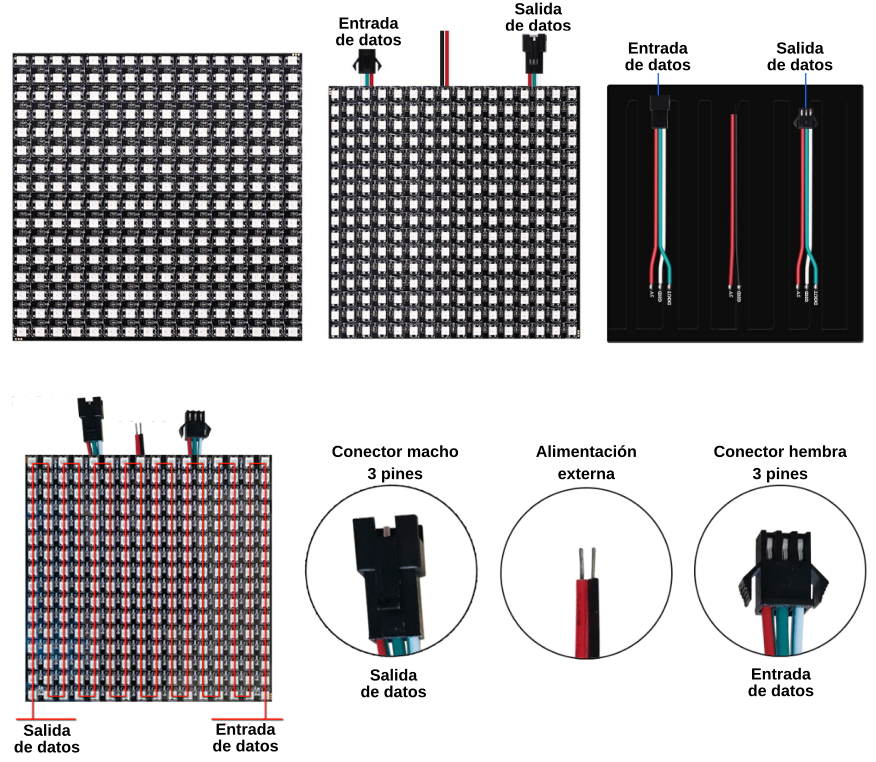
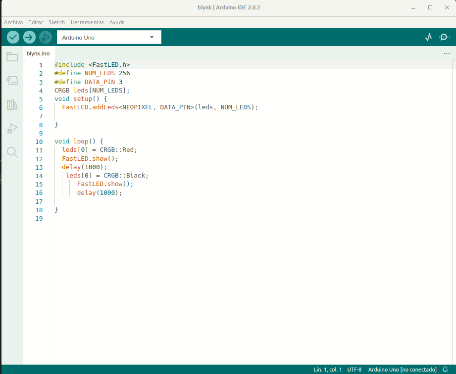
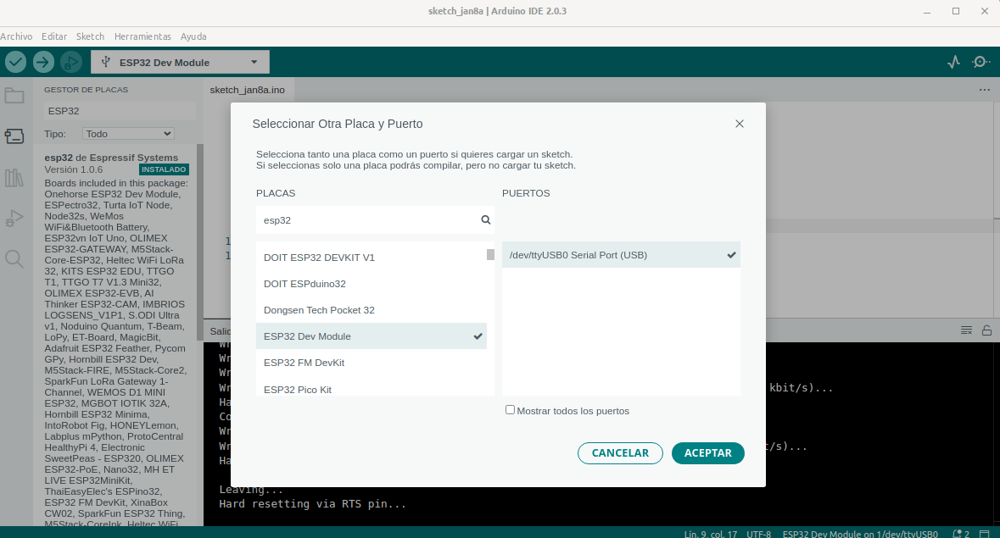
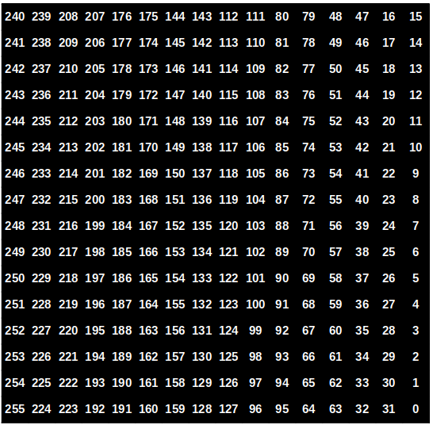
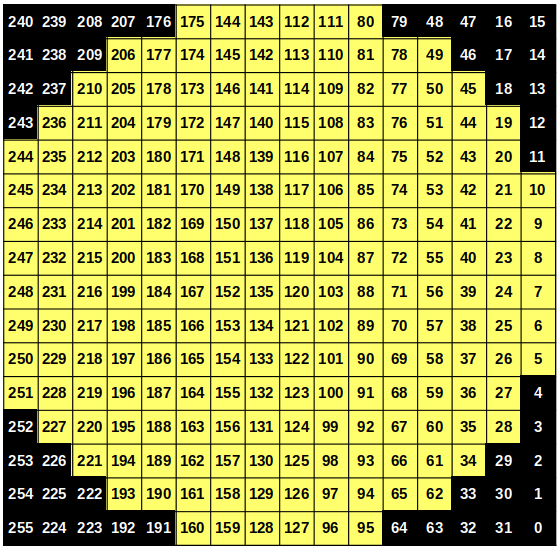
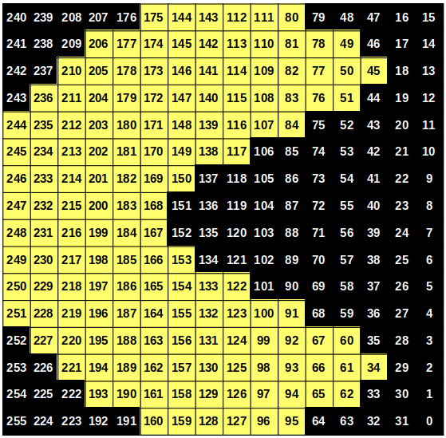
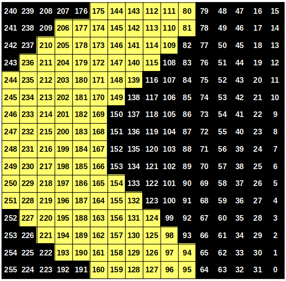
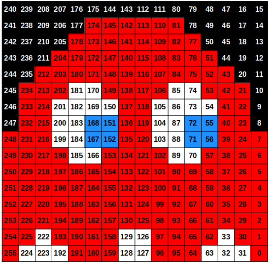
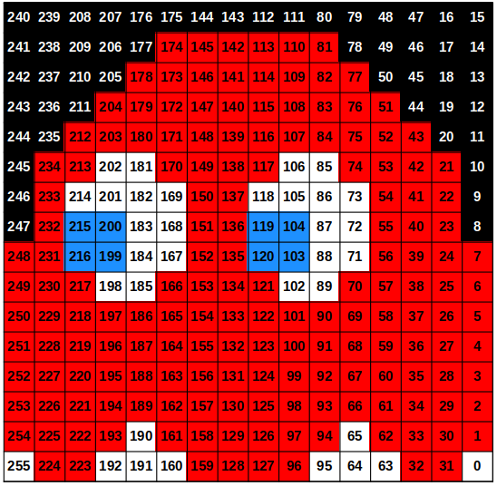

# Matriz o panel de 16x16

## **Descripción**
En realidad se trata de tiras de 256 LEDs dispuestos en forma de panel o matriz que tienen el aspecto de la figura siguiente:

*Aspecto de una matriz de 16x16*

Podemos decir que todo lo dicho para la matriz de 8x32 es válido para esta salvo la disposición que en lugar de ser rectangular es cuadrada. Con las adaptaciones adecuadas incluso los ejemplos siguen la misma filosofía si utilizamos las librerías citadas en la sección [Matrices de 8x32](matriz8x32.md).

## **Librería FastLED**
Es una alternativa a la librería *Adafruit_NeoPixel*, que proporciona características más avanzadas y funciona con otros tipos de LEDs como DotStars, que resultan tan interesantes que merecen ser tratados de forma separada. FastLED funciona de manera completamente diferente; no es un reemplazo directo para Adafruit_NeoPixel, y los programas que tengamos requerirán ser reescritos.

La librería es compatible con este [listado de chip](https://github.com/FastLED/FastLED/wiki/Chipset-reference) y se ejecuta en una amplia gama de [plataformas](https://github.com/FastLED/FastLED/wiki/Overview#wiki-platforms) de Arduino y compatibles, incluidos los basados en AVR y ARM.

La librería presenta las siguientes características:

* Soporte para [modelo de color HSV](https://es.wikipedia.org/wiki/Modelo_de_color_HSV#:~:text=Se%20representa%20como%20un%20grado,amarillo%20y%20120%20es%20verde.) asi como el clásico RGB. En [Setting HSV Colors](https://github.com/FastLED/FastLED/wiki/Pixel-reference#wiki-chsv) tenemos detalles del tema en inglés.
* La configuración del brillo permite controlar, ademas del brillo, el uso de energia y por lo tanto la duración de una posible batería, si se utiliza.
* Funciones matemáticas y de acceso a memoria hasta 10 veces mas rápidas que las clásicas de Arduino.

Para comenzar basta con [descargar la librería](http://fastled.io/releases) y comenzar a probar código básico. Lo que vamos a ver a continuación es la información básica sobre el uso de la librería.

### Configuración de los LEDs
Cuando vamos a escribir código necesitamos saber que LEDs estamos utilizando, cuantos hay y a que pin de salida de datos los vamos a conectar. Para los siguientes ejemplos trabajamos con una tira de 256 LEDs dispuestos en forma de matriz de 16x16 y los conectaremos al pin digital 3.

Entra dentro de las buenas prácticas en programación hacer el código lo mas fácil de leer que sea posible y que cuando necesitemos realizar cambios en las condiciones lo tengamos que hacer solamente en un lugar. Como ejemplo a continuación vemos dos formas de escribir una línea de código

~~~
FastLED.addLeds<4, 3>(leds, 256); // Forma 1
FastLED.addLeds<NEOPIXEL, DATA_PIN>(leds, NUM_LEDS); // Forma  2
~~~

La Forma 1 utiliza números simples para definir las cosas mientras que la Forma 2 utiliza nombres, lo que hace al código mas legible y si, por ejemplo queremos cambiar el número de LEDs basta con hacerlo en la definición de NUM_LEDS.

Dicho esto nuestras primeras líneas de código van a ser:

~~~
#include <FastLED.h> // Incluimos la librería
#define NUM_LEDS 256 // Definimos el número de LEDs
#define DATA_PIN 3 // Definimos el pin de datos
CRGB leds[NUM_LEDS]; // Configura el bloque de memoria (matriz) para almacenar y manipular datos del LED
~~~

El siguiente paso es configurar nuestros LEDs en el bucle inicializar o setup. Esto se hace como vemos a continuación:

~~~
void setup() { 
    FastLED.addLeds<NEOPIXEL, DATA_PIN>(leds, NUM_LEDS);
}
~~~

La línea de configuración indica que hay una tira de NEOPIXEL conectada al pin 3, que esos LEDs utilizaran la matriz *leds* y en el número definido de 256.

Si estamos utilizando chips de cuatro cables debemos cambiar esta línea de configuración para lo que consultaremos la documentación original indicada en los enlaces.

### Encender y apagar un LED
El proceso de establecer un color para los LEDs se realiza estableciendo los valores de la matriz *leds* y posteriormente indicando a la biblioteca que muestre los datos. Por ejemplo, el siguiente código enciende en verde el primer LED.

~~~
void loop() {
    // Enciende el primer LED en verde
    leds[0] = CRGB::Green; 
    FastLED.show(); 
    delay(30); 
}
~~~

El color es un tipo de dato enumerado (una lista de valores) que podemos consultar [aquí](http://fastled.io/docs/3.1/struct_c_r_g_b.html) y que, como vemos en la animación de la figura siguiente, se mostrarán como opciones disponibles cuando tecleamos el color en la línea de código.

*Opciones de colores cuando tecleamos*

Apagar el LED consiste en ponerlo en color negro de forma similar a la vista anteriormente.

El código del programa completo [Blynk](../programas/blynk.zip) es el siguiente:

~~~
#include <FastLED.h>
#define NUM_LEDS 256
#define DATA_PIN 3#include "FastLED.h"
CRGB leds[60];
void setup() { FastLED.addLeds<NEOPIXEL, 6>(leds, 60); }
void loop() { 
  static uint8_t hue = 0;
  FastLED.showColor(CHSV(hue++, 255, 255)); 
  delay(10);
}
CRGB leds[NUM_LEDS];

void setup() {
  FastLED.addLeds<NEOPIXEL, DATA_PIN>(leds, NUM_LEDS);
}

void loop() {
  // Encender el primer LED en verde
  leds[0] = CRGB::Green; 
  FastLED.show(); 
  delay(1000);
  // Apagar el primer LED
  leds[0] = CRGB::Black;
  FastLED.show();
  delay(1000);
}
~~~

## **Ejemplos**
A continuación vamos a ver diferentes ejemplos comentando en cada uno el concepto relativo a la librería que se introduce y, como no, que hace el programa.

### Encender y apagar todos los pixeles
Simplemente hacemos un bucle para recorrer la tira completa y ver como están conectados los LEDs. El programa [ON_OFF_todos](../programas/ON_OFF_todos.zip) tiene el siguiente código:

~~~
#include <FastLED.h>
#define NUM_LEDS 256
#define DATA_PIN 3
CRGB leds[NUM_LEDS];

void setup() {
  FastLED.addLeds<NEOPIXEL, DATA_PIN>(leds, NUM_LEDS);
}

void loop() {
  for(int pixel=0; pixel<NUM_LEDS; pixel++){
    leds[pixel] = CRGB::Blue;
    FastLED.show();
    // Apagar el LED encendido para ver la siguiente iteracion del bucle
    leds[pixel] = CRGB::Black;
    delay(50);
  }
}
~~~

### Libreria HSV
La librería proporciona una conversión rápida de HSV a RGB ajustada a la percepción humana del color. Al definir colores con RGB, estamos mezclando los valores de color rojo, verde y azul. Cuando usamos HSV estamos definiendo el tono del color (es decir, dónde está en la rueda de colores), qué tan saturado está y qué tan brillante es. Por ejemplo, el programa [HSV_color](../programas/HSV_color.zip) recorrerá los colores del arcoíris.

~~~
#include <FastLED.h>
#define NUM_LEDS 256
#define DATA_PIN 3
#define BRILLO 15 
CRGB leds[NUM_LEDS];

void setup() {
  FastLED.addLeds<NEOPIXEL, DATA_PIN>(leds, NUM_LEDS);
  FastLED.setBrightness(BRILLO);
}

void loop() {
  static uint8_t matiz = 0;
  FastLED.showColor(CHSV(matiz++, 255, 255)); 
  delay(10);
}
~~~

## **Ejemplos con ESP32 STEAMakers + TdR STEAM**
En este apartado vamos a crear algún ejemplo utilizando este conjunto de placas de las que podemos encontrar información en [Notas sobre ESP32 STEAMakers](https://fgcoca.github.io/ESP32-STEAMakers/).

También vamos a ver los ejemplos disponibles en la página [16x16 RGB LED Panel Arduino Projects](https://www.instructables.com/16x16-RGB-LED-Panel-Arduino-Projects/) by coberfranc en Autodesk Instructables.

Para instalar las placas ESP32, nos dirigimos a 'URLs adicionales de gestor de placas' disponible en 'Preferencias' y [pegaremos la URL](https://dl.espressif.com/dl/package_esp32_index.json). Esto hará que tengamos estas placas disponibles en el gestor de placas desde podemos instalarlas.

Siempre vamos a partir de la base de que en el gestor de placas ya hemos instalado el [Arduino Core for ESP32](https://github.com/espressif/arduino-esp32) de [Espressif Systems](https://github.com/espressif) tal y como vemos en la figura siguiente:

*esp32 instalado*

En la figura podemos también ver la selección de placa y de puerto realizada.

### Blink con LED rojo
Vamos a comenzar por este sencillo ejemplo que nos servirá para describir el entorno en el que vamos a programar. Analizando la documentación vemos que el LED rojo está conectado al pin D12 que se corresponde con el pin IO19 o pin 19 de propósito general de entrada salida en la ESP32.

El código del programa lo tenemos a continuación:

~~~
void setup() {
  pinMode(19, OUTPUT);
}

void loop() {
   	digitalWrite(19,HIGH);
    delay(1000);
    digitalWrite(19, LOW);
    delay(1000);
}
~~~

### Encender pixeles con potenciómetro
Vamos a tener el potenciómetro conectado al pin A0 de la TdR STEAM, que en la ESP32 es el pin IO02, y nos entregará un valor de 0 a 4095 (DAC de 12 bits). Utilizando la función de mapeo convertimos ese rango de valores en un nuevo rango que será el número de LEDs. El pin que vamos a utilizar como salida de datos es el asociado al conector D3, que en la ESP32 es el pin IO25. El programa [NLEDs_pot](../programas/NLEDs_pot.zip) tiene el código siguiente:

~~~
#include <FastLED.h>
#define NUM_LEDS_M 256
#define DATA_PIN 25
#define BRILLO 15 
CRGB leds[NUM_LEDS_M];

void setup() {
  pinMode(DATA_PIN, OUTPUT);
  FastLED.addLeds<NEOPIXEL, DATA_PIN>(leds, NUM_LEDS_M);
  FastLED.setBrightness(BRILLO);
}

void loop() {
int num = analogRead(2);
  int pixelesON = map(num, 0, 4095, 0, NUM_LEDS_M);
  FastLED.clear(); // Limpiamos la matriz
  for(int led = 0; led < pixelesON; led++) { 
    leds[led] = CRGB::Purple; 
    }
  FastLED.show();
}
~~~

En el siguiente video vemos el funcionamiento del ejemplo:

<iframe width="560" height="315" src="https://www.youtube.com/embed/BAM5cENR7jA" title="YouTube video player" frameborder="0" allow="accelerometer; autoplay; clipboard-write; encrypted-media; gyroscope; picture-in-picture; web-share" allowfullscreen></iframe>

### Colores aleatorios en el panel
Se trata del ejemplo [16random.ino](https://content.instructables.com/F6A/P4G0/K5ME7GZ9/F6AP4G0K5ME7GZ9.ino) en el que se van encendiendo de forma y en color aleatorio diferentes pixeles. Este es el código adaptado a ESP32 STEAMaker + TdR STEAM:

~~~
#include "FastLED.h"
#define NUM_LEDS 256
#define DATA_PIN 25
CRGB leds[NUM_LEDS];

void setup() {
  delay(2000);
  FastLED.addLeds<WS2812B, DATA_PIN, RGB>(leds, NUM_LEDS);
  FastLED.setBrightness(10); //Numero de 0 a 255
  FastLED.clear();
}

int random_integer;
int random_integer2;
void loop() {
    for(int i = 0; i 
 0; k--){
            leds[k] = CRGB::Black;
       }
    }
}
~~~

El video siguiente nos muestra el funcionamiento del ejemplo:

<iframe width="560" height="315" src="https://www.youtube.com/embed/tTY8ZMNAncY" title="YouTube video player" frameborder="0" allow="accelerometer; autoplay; clipboard-write; encrypted-media; gyroscope; picture-in-picture; web-share" allowfullscreen></iframe>

### Paleta de Colores en el panel
Se trata del ejemplo [16counter.ino](https://content.instructables.com/FYD/4KG5/K5ME7GZB/FYD4KG5K5ME7GZB.ino) en el que en un primer bucle que iteraciona tres veces se encienden todos los LEDs de uno en uno cambiando de color hasta que están todos encendidos que es cuando comienzan a apagarse de forma inversa. En otro bucle similar se encienden todos los LEDs pero de uno en uno también cambiando de color y comenzando las tres veces desde el principio. Este es el código adaptado a ESP32 STEAMaker + TdR STEAM:

~~~
#include "FastLED.h"
#define NUM_LEDS 256
#define DATA_PIN 25
CRGB leds[NUM_LEDS];

void setup() {
  delay(2000);
  FastLED.addLeds<WS2812B, DATA_PIN, RGB>(leds, NUM_LEDS);
  FastLED.setBrightness(10); //Number 0-255
  FastLED.clear();
}

int colorcalc;

void loop() {
    colorcalc = 0;    
    for(int i = 0; i < 3; i++){
       for(int j = 0; j < 256; j++){
            colorcalc = colorcalc + 1;
            leds[j].setHue(colorcalc);luces
            FastLED.show();
            delay(20);
       } 
       for(int j = 256; j > 0; j--){
          leds[j] = CRGB::Black;
          FastLED.show();
          delay(20);luces
       }
    }
    for(int i = 0; i < 3; i++){
       for(int j = 0; j < 256; j++){
            colorcalc = colorcalc + 1;
            leds[j].setHue(colorcalc);
            FastLED.show();
            delay(20);
            leds[j] = CRGB::Black;
            FastLED.show();
        } 
    }luces
}
~~~

El video siguiente nos muestra el funcionamiento del ejemplo:

<iframe width="560" height="315" src="https://www.youtube.com/embed/OLOSoVND4sg" title="YouTube video player" frameborder="0" allow="accelerometer; autoplay; clipboard-write; encrypted-media; gyroscope; picture-in-picture; web-share" allowfullscreen></iframe>

### Pacman
Se trata del ejemplo [16pacman.ino](https://content.instructables.com/F7O/ZECF/K5ME7GZA/F7OZECFK5ME7GZA.ino) en el que se verá el clásico Pacman amarillo animado. El diseño se ayuda de una tabla que actúa a modo de plantilla. En la tabla se hace coincidir cada número de celda con su número de pixel correspondiente según la relación de la figura siguiente:

*Plantilla 16x16 para diseño*

luces

El color negro de fondo representa el apagado de los LEDs.

En la figura siguiente vemos el diseño del cuerpo del Pacman

*Cuerpo del Pacman*

En la figura siguiente vemos el diseño de la boca medio abierta.

*Boca medio abierta*

En la figura siguiente vemos el diseño de la boca abierta.

*Boca abierta*

Este es el código adaptado a ESP32 STEAMaker + TdR STEAM:

~~~
#include "FastLED.h"
#define NUM_LEDS 256luces
#define DATA_PIN 25
CRGB leds[NUM_LEDS];

void setup() {
  delay(2000);
  FastLED.addLeds<WS2812B, DATA_PIN, RGB>(leds, NUM_LEDS);
  FastLED.setBrightness(10);
  FastLED.clear();
}
int eyes_seconds = 2;luces
int reg_ghost_seconds = 10;
int feet_delay = 220;
int eye_loop = (eyes_seconds*1000)/feet_delay; 
int reg_ghost_loop = reg_ghost_seconds/eyes_seconds; 
int sad_ghost_loop = 50;
int sad_ghost_blink_loop = 10;

int body[] = {
5,6,7,8,9,10,19,20,21,22,
23,24,25,26,27,28,34,35,36,37,
38,39,40,41,42,43,44,45,49,50,
51,52,53,54,55,56,57,58,59,60,
61,62,65,66,67,68,69,70,71,72,
73,74,75,76,77,78,80,81,82,83,
84,85,86,87,88,89,90,91,92,93,
94,95,96,97,98,99,100,101,102,103,
104,105,106,107,108,109,110,111,112,113,
114,115,116,117,118,119,120,121,122,123,
124,125,126,127,128,129,130,131,132,133,
134,135,136,137,138,139,140,141,142,143,
144,145,146,147,148,149,150,151,152,153,
154,155,156,157,158,159,160,161,162,163,
164,165,166,167,168,169,170,171,172,173,
174,175,177,178,179,180,181,182,183,184,
185,186,187,188,189,190,193,194,195,196,
197,198,199,200,201,202,203,204,205,206,
210,211,212,213,214,215,216,217,218,219,
220,221,227,228,229,230,231,232,233,234,
235,236,245,246,247,248,249,250
};

int mouth_half_open[] = {
5,6,7,8,9,10,19,20,21,22,
23,24,25,26,27,28,35,36,37,38,
39,40,41,42,43,44,52,53,54,55,
56,57,58,59,68,69,70,71,72,73,
74,75,85,86,87,88,89,90,101,102,
103,104,105,106,118,119,120,121,134,135,
136,137,151,152
};

int mouth_open[] = {luces
5,6,7,8,9,10,19,20,21,22,
23,24,25,26,27,28,34,35,36,37,
38,39,40,41,42,43,44,45,49,50,
51,52,53,54,55,56,57,58,59,60,
61,62,65,66,67,68,69,70,71,72,
73,74,75,76,77,78,82,83,84,85,
86,87,88,89,90,91,92,93,99,100,
101,102,103,104,105,106,107,108,116,117,
118,119,120,121,122,123,133,134,135,136,
137,138,150,151,152,153luces
};

int filler[] = {
138,116,117,107,108,84,83,82,78,77,
76,49,50,51,45,153,133,122,123,100,
99,91,92,93,67,66,65,60,61,62,
34
};

void loop() {
    for(int i = 0; i < reg_ghost_loop; i++){
        for(int i = 0; i < eye_loop; i++){
            //CUERPO
            for (int i = 0; i < 208; i++){  
                  leds[body[i]] = CRGB::Yellow;
            }
            FastLED.show();
            delay(200);
            //BOCA MEDIO ABIERTA
            for (int i = 0; i < 64; i++){      
                  leds[mouth_half_open[i]] = CRGB::Black;
            }
            FastLED.show();
            delay(200);
            //BOCA ABIERTA
            for (int i = 0; i < 96; i++){      
                  leds[mouth_open[i]] = CRGB::Black;
            }
            FastLED.show();
            delay(200);
            //CUERPO
            for (int i = 0; i < 31; i++){      
                  leds[filler[i]] = CRGB::Yellow;
            }
            FastLED.show();
            delay(200);
         } 

    } 
}
~~~

El video siguiente nos muestra el funcionamiento del ejemplo:

<iframe width="560" height="315" src="https://www.youtube.com/embed/YVKq5vzJKpk" title="YouTube video player" frameborder="0" allow="accelerometer; autoplay; clipboard-write; encrypted-media; gyroscope; picture-in-picture; web-share" allowfullscreen></iframe>

### Remolino de colores
Se trata del ejemplo [16colormatrix.ino](https://content.instructables.com/FH3/96OX/K5ME7GZC/FH396OXK5ME7GZC.ino) en el que se aplican funciones auxiliares para una matriz XY bidimensional.

- La función ***XY(x,y)*** toma las coordenadas 'x e y' y devuelve el número de índice LED, para usarla debemos invocarla así:

~~~
leds[ XY(x,y) ] == CRGB::Red;
~~~

Esta función no realiza ninguna comprobación de errores.

- La función ***XYsafe(x,y)*** toma las coordenadas 'x e y' y devuelve el número de índice LED, para usarla debemos invocarla así:

~~~
leds[ XYsafe(x,y) ] == CRGB::Red;
~~~

La verificación de errores se realiza en los rangos de x e y, y se devuelve un índice de "-1".

También se define un parámetro para diferenciar la forma en que están conectados los LEDs que en los comentarios del ejemplo original indican lo siguiente: "*Vocabulario adicional: cualquier cosa que vaya en una dirección en una fila, y luego hacia atrás en la fila siguiente, y así sucesivamente, se llama "[Bustrofedon](https://es.wikipedia.org/wiki/Bustrofedon)", que significa "como ara el buey".*"

Esta función devolverá el 'número de índice de led' para un conjunto dado de coordenadas X e Y en la matriz si lo indicamos de manera correcta, es decir, la función no controla LOS LÍMITES DE COORDENADAS, así que no debemos pasarle valores falsos.

Este es el código adaptado a ESP32 STEAMaker + TdR STEAM:

~~~
#include <FastLED.h>
#define LED_PIN  25
#define COLOR_ORDER GRB
#define CHIPSET WS2812B
#define BRIGHTNESS 10

// Parametros de anchura y altura
const uint8_t kMatrixWidth = 16;
const uint8_t kMatrixHeight = 16;

// Parametro para diferenciar la forma de conexionado de los LEDs:
// La ponemos a false si los pixeles están dispuestos como una tira
// la ponemos a true si están dispuestos en zig-zag
const bool kMatrixSerpentineLayout = true;

uint16_t XY( uint8_t x, uint8_t y)
{
  uint16_t i;
  
  if( kMatrixSerpentineLayout == false) {
    i = (y * kMatrixWidth) + x;
  }

  if( kMatrixSerpentineLayout == true) {
    if( y & 0x01) {
      // Odd rows run backwards
      uint8_t reverseX = (kMatrixWidth - 1) - x;
      i = (y * kMatrixWidth) + reverseX;
    } else {
      // Even rows run forwards
      i = (y * kMatrixWidth) + x;
    }
  }
  
  return i;
}

#define NUM_LEDS (kMatrixWidth * kMatrixHeight)
CRGB leds_plus_safety_pixel[ NUM_LEDS + 1];
CRGB* const leds( leds_plus_safety_pixel + 1);

void setup() {
  FastLED.addLeds<CHIPSET, LED_PIN, COLOR_ORDER>(leds, NUM_LEDS).setCorrection(TypicalSMD5050);
  FastLED.setBrightness( BRIGHTNESS );
}

uint16_t XYsafe( uint8_t x, uint8_t y)
{
  if( x >= kMatrixWidth) return -1;
  if( y >= kMatrixHeight) return -1;
  return XY(x,y);
}

void loop()
{
    uint32_t ms = millis();
    int32_t yHueDelta32 = ((int32_t)cos16( ms * (27/1) ) * (350 / kMatrixWidth));
    int32_t xHueDelta32 = ((int32_t)cos16( ms * (39/1) ) * (310 / kMatrixHeight));
    DrawOneFrame( ms / 65536, yHueDelta32 / 32768, xHueDelta32 / 32768);
    if( ms < 5000 ) {
      FastLED.setBrightness( scale8( BRIGHTNESS, (ms * 256) / 5000));
    } else {
      FastLED.setBrightness(BRIGHTNESS);
    }
    FastLED.show();
}

void DrawOneFrame( byte startHue8, int8_t yHueDelta8, int8_t xHueDelta8)
{
  byte lineStartHue = startHue8;
  for( byte y = 0; y < kMatrixHeight; y++) {
    lineStartHue += yHueDelta8;
    byte pixelHue = lineStartHue;      
    for( byte x = 0; x < kMatrixWidth; x++) {
      pixelHue += xHueDelta8;
      leds[ XY(x, y)]  = CHSV( pixelHue, 255, 255);
    }
  }
}
~~~

En el siguiente video vemos el funcionamiento del ejemplo:

<iframe width="560" height="315" src="https://www.youtube.com/embed/SeRG5zHJamw" title="YouTube video player" frameborder="0" allow="accelerometer; autoplay; clipboard-write; encrypted-media; gyroscope; picture-in-picture; web-share" allowfullscreen></iframe>

### Fantasma PACMAN en rojo
Se trata del ejemplo [16red.ino](https://content.instructables.com/F32/NPHD/K5ME7GZ8/F32NPHDK5ME7GZ8.ino) en el que se dibuja un fantasma de color rojo del juego PACMAN y se hace que mueva los ojos a izquierda y derecha y también que mueva los pies. El diseño se ayuda de una tabla que actúa a modo de plantilla. En la tabla se hace coincidir cada número de celda con su número de pixel correspondiente según la relación de la figura siguiente:

*Plantilla 16x16 para diseño*

El color negro de fondo representa el apagado de los LEDs.

En la figura siguiente vemos el diseño del fantasma mirando a su izquierda.

*Fantasma mirando a su izquierda*

En la figura siguiente vemos el diseño del fantasma mirando a su derecha.

*Fantasma mirando a su derecha*

Este es el código adaptado a ESP32 STEAMaker + TdR STEAM:

~~~
//FANTASMA PACMAN ANIMADO
#include "FastLED.h"
#define NUM_LEDS 256
#define DATA_PIN 25
CRGB leds[NUM_LEDS];
void setup() {
  delay(2000);
  FastLED.addLeds<WS2812B, DATA_PIN, RGB>(leds, NUM_LEDS);
  FastLED.setBrightness(10); //Numero entero entre 0 y 255
  FastLED.clear();
}
int body[] = {
0,1,2,3,4,5,6,7,21,22,
23,24,25,26,27,28,29,30,31,32,
33,34,35,36,37,38,39,40,41,42,
43,51,52,53,54,55,56,57,58,59,
60,61,62,63,64,65,66,67,68,69,
70,71,72,73,74,75,76,77,81,82,
83,84,85,86,87,88,89,90,91,92,
93,94,95,96,97,98,99,100,101,102,
103,104,105,106,107,108,109,110,113,114,
115,116,117,118,119,120,121,122,123,124,
125,126,127,128,129,130,131,132,133,134,
135,136,137,138,139,140,141,142,145,146,
147,148,149,150,151,152,153,154,155,156,
157,158,159,160,161,162,163,164,165,166,
167,168,169,170,171,172,173,174,178,179,
180,181,182,183,184,185,186,187,188,189,
190,191,192,193,194,195,196,197,198,199,
200,201,202,203,204,212,213,214,215,216,
217,218,219,220,221,222,223,224,225,226,
227,228,229,230,231,232,233,234,248,249,
250,251,252,253,254,255
};

int eyes_left[] = {
54,55,56,
70,71,72,73,74,
85,86,87,88,89,
103,104,105,
150,151,152,
166,167,168,169,170,
181,182,183,184,185,
199,200,201};

int eyes_right[] = {
71,72,73,
85,86,87,88,89,
102,103,104,105,106,
118,119,120,
169,168,167,
181,182,183,184,185,
202,201,200,199,198,
214,215,216};

int eyes_fill_body[] = {
149,150,151,152,153,53,54,55,56,57};

//eliminar pixeles alrededor de los pies
int void_pixels_1[] = {8, 29, 30, 31, 83, 84, 85, 86, 138, 139, 140, 161};
int void_pixels_2[] = {7, 31, 55, 56, 57, 112, 113, 114, 138, 162};

int feet_fill_body[] = {
224,222,129,128,63,33};

int sad_ghost[] = {11, 26, 35, 48, 49, 53, 60, 64, 65, 80, 89, 104, 105, 109, 116, 120, 121, 134, 143, 158};

int eyes_seconds = 2;
int reg_ghost_seconds = 10;

int feet_delay = 220; 
int eye_loop = (eyes_seconds*1000)/feet_delay; // cuanto tiempo mira a izquierda y derecha 

int reg_ghost_loop = reg_ghost_seconds/eyes_seconds; 
int sad_ghost_loop = 50;
int sad_ghost_blink_loop = 10;

int pupil_right[] = {
151,152,
168,167,
72,71,
55,56};

int pupil_left[] = {
215,216,
200,199,
119,120,
104,103};

int feet_left[] = {
222,224,223,192,
129,126,128,127,
33,63,32,31};

int feet_right[] = {
255,
190,191,192,160,
65,64,63,95,
0};

int feet_fill[] = {
31,32,33,
224,223,222,
129,128,126,127};

int feet_fill2[] = {
31,32,33,
224,223,222,
129,128,126,127};

int feet_clear[] = {
254,225,222,193,190,161,158,129,126,97,94,65,62,33,30,1,
255,224,223,192,191,160,159,128,127,96,95,64,63,32,31,0
  };

void loop() {
    for(int i = 0; i < reg_ghost_loop; i++){
        for(int i = 0; i < eye_loop; i++){
            //Cuerpo
            for (int i = 0; i < 206; i++){ 
                  leds[body[i]] = CRGB::Green;
            }
            //Ojos 
            for (int i = 0; i < 32; i++){
                leds[eyes_left[i]] = CRGB::White;
            }            
            //Pupilas
            for (int i = 0; i < 8; i++){
                leds[pupil_right[i]] = CRGB::DarkBlue;
            }
            FastLED.show();
            //Pies
            for(int i = 0; i < 2; i++){
              //configura pie 
              for (int i = 0; i < 12; i++){
                  leds[feet_left[i]] = CRGB::Black;
               }
              FastLED.show();
              delay(feet_delay);
              //configura pie 
              for (int i = 0; i < 12; i++){
                  leds[feet_right[i]] = CRGB::Black;
              }
              for (int i = 0; i < 10; i++){
                  leds[feet_fill[i]] = CRGB::Green;
              }
              FastLED.show();
              delay(feet_delay);
              for (int i = 0; i < 32; i++){
                  leds[feet_clear[i]] = CRGB::Green;
              }
            } //fin bucle pies
            //Cambio ojos            
            //Cuerpo
            for (int i = 0; i < 206; i++){  
                  leds[body[i]] = CRGB::Green;
            }
            //Ojos 
            for (int i = 0; i < 32; i++){
                leds[eyes_right[i]] = CRGB::White;
            }            
            //Pupilas
            for (int i = 0; i < 8; i++){
                leds[pupil_left[i]] = CRGB::DarkBlue;
            }
            FastLED.show();
            //Pie
            for(int i = 0; i < 2; i++){
              //configura pie 
              for (int i = 0; i < 12; i++){
                  leds[feet_left[i]] = CRGB::Black;
               }
              FastLED.show();
              delay(feet_delay);
              //configura pie  
              for (int i = 0; i < 12; i++){
                  leds[feet_right[i]] = CRGB::Black;
              }
              for (int i = 0; i < 10; i++){
                  leds[feet_fill[i]] = CRGB::Green;
              }
              FastLED.show();
              delay(feet_delay);
              for (int i = 0; i < 32; i++){
                  leds[feet_clear[i]] = CRGB::Green;
              }
            } //fin bucle pies
         }  //fin  bucle ojos
    } //fin  bucle fantasma
}
~~~

En el siguiente video vemos el funcionamiento del ejemplo:

<iframe width="560" height="315" src="https://www.youtube.com/embed/TTJQEFsm1pY" title="YouTube video player" frameborder="0" allow="accelerometer; autoplay; clipboard-write; encrypted-media; gyroscope; picture-in-picture; web-share" allowfullscreen></iframe>

