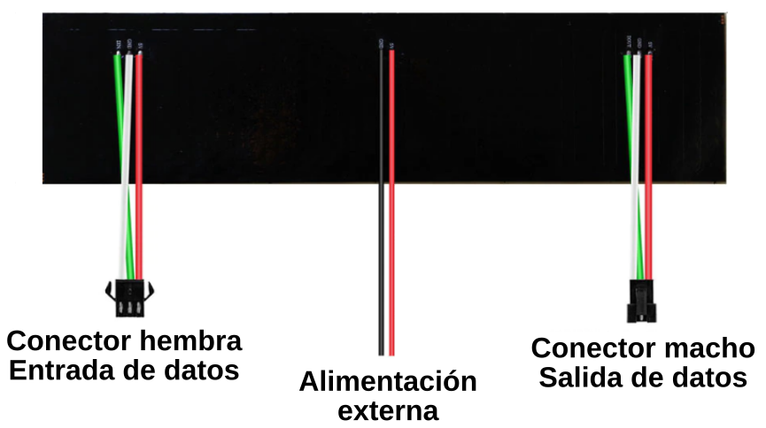

# Matriz o panel de 8x32

## **Descripción**

En realidad se trata de tiras de 256 LEDs dispuestos en forma de panel o matriz que tienen el aspecto de la figura siguiente:

*Aspecto de una matriz de 8x32*

Podemos observar que este tipo de paneles son, hasta cierto punto, flexibles y que permiten utilizar el concepto de apilado o encadenado conectando la salida de uno a la entrada del otro. En principio la única limitación de conexionado va a estar en la capacidad de entregar la corriente que demande la configuración de paneles.

Referente al tema de la alimentación hemos de tener presente que cada uno de los LEDs puede consumir hasta 60 mA (20 mA cada color) si combinamos los colores a máximo brillo para obtener un color blanco intenso, por lo que el consumo máximo puede ser de:

$I\_max = 8 \cdot32  \cdot 60 = 15.360\space mA$

Es decir, que en las condiciones indicadas un panel puede llegar a consumir por encima de 15A, lo que nos indica claramente que tampoco están diseñados para trabajar de esta forma.

En condiciones de brillo por debajo de 100 y los LEDs cambiando su estado (por ejemplo en un letrero que se desplaza) un panel se puede alimentar desde el conector de entrada que tiene 3 pines: DIN, 5V y GND.

Los LEDs WS2812 que se utilizan son de 4 pines que se distribuyen en cada LED como vemos en la figura siguiente:

*Pines LED WS2812*

El panel o matriz que vamos a utilizar conecta los LEDs como vemos en la figura siguiente:

*Panel con conexión en linea*

La parte posterior de este panel tiene el aspecto de la figura siguiente:

*Parte posterior del panel*

Aunque debemos tener presente que los LEDs se pueden conectar de cualquiera de las formas que vemos en la figura siguiente:

*Conexiones en zig zag y en linea*

## **Programación con ArduinoBlocks**

### Bloques
En la figura siguiente vemos el menú bloques disponible en 'Visualización' en su entrada 'NeoPixel'. 

*Bloques LEDs RGB direccionables*

Ya hemos indicado que la disposición en forma de matriz no implica que el conexionado de los LEDs esté realizado de esa forma, sino que están conectados como si de una tira se tratase y por ello los bloques tipo matriz no van a servirnos de mucha ayuda en la programación de estos elementos, y por eso se han puesto difuminados.

Para demostrar esto se anima al lector a analizar el posible resultado de un simple programa como el de la figura siguiente:

*Ejemplo para demostrar que no se programa como matriz*

Si cargamos el programa [Ej_no_matriz.abp](../programas/Ej_no_matriz.abp) en nuestra placa y lo hacemos funcionar con el panel conectado podremos observar como su comportamiento nada tiene que ver con el esperado.

### Ejemplos de uso
Vamos a ver una serie de ejemplos de uso del panel tratado como tira de LEDs direccionables para ver que así funciona perfectamente.

* **A1. Encender y apagar todos los LEDs**. En esta primera actividad vamos a establecer un nivel de brillo lo suficientemente bajo (15) como para que cuando se enciendan todos los LEDs nuestro USB no se desconecte por exceso de consumo. Si queremos trabajar con brillos mayores basta con alimentar el panel a través de los cables destinados a ello con una fuente de alimentación adecuada, pero recordemos el consumo máximo que pueden llegar a tener si los ponemos todos a máximo brillo y en blanco, que supera los 15A. Por otro lado en el bucle de encendido hemos dado un pequeño retardo que demuestra claramente como están conectados los LEDs. En el enlace tenemos el programa [A1. Encender y apagar todos los LEDs](../programas/on_off.abp) siguiente:

*A1. Encender y apagar todos los LEDs*

* **A2. Encender todos desplazando el LED encendido**. Se trata del mismo bucle que en la actividad anterior pero en esta ocasión borramos los datos en cada iteración haciendo así que solamente se encienda un LED. En el enlace tenemos el programa [A2. Encender todos desplazando el LED encendido](../programas/on_1en1.abp) siguiente:

*A2. Encender todos desplazando el LED encendido*

* **A3. Encender pares e impares con color aleatorio**. Con un bucle encendemos los LEDs de color par después de llamar a la función que establece de forma aleatoria los valores RGB, con otro hacemos lo mismo pero con los impares y finalmente con otro bucle los apagamos todos durante un tiempo. En el enlace tenemos el programa [A3. Encender pares e impares con color aleatorio](../programas/par_impar.abp) siguiente:

*A3. Encender pares e impares con color aleatorio*

***
<b>De esta forma podemos seguir haciendo cosas con el panel pero la verdad es que salvo la disposición de los LEDs no se ven muchas mas posibilidades</b>

***

### **Trabajo con la herramienta Neopixel - Matrix data**
Accedemos a ella a través el menú herramientas, tal y como vemos en la animación de la figura siguiente. Observamos como establecer el tipo de matriz según estén conexionados los LEDs en línea o zig zag y simplemente se han pintado algunos pixeles de diferentes colores a modo de ejemplo.

*Herramienta Neopixel - Matrix data*

*Ejemplo de uso de la herramienta Neopixel - Matrix data*

Mostrar ese diseño en la matriz es tan sencillo como hacer un programa como el de la figura siguiente.

*Ejemplo de uso de la herramienta Neopixel - Matrix data*

Hemos copiado los datos generados en el bloque 'Establecer datos'. Es posible realizar diseños mas complejos con esta herramienta, como por ejemplo escribir textos, pero nos vamos a encontrar que es un trabajo bastante complejo, lento y tedioso al que además se añade una dificultad, y es que el diseño en pantalla está en posición espejo (como si se reflejase en uno) respecto a la posición real de los diodos del panel del que dispongo. Un ejemplo, con algún pequeño error que no se ha corregido a propósito, como el que vemos en el vídeo siguiente ha costado algo mas de una hora llevarlo a cabo.Adafruit_NeoMatrix

<iframe width="560" height="315" src="https://www.youtube.com/embed/mZbF2w7pb5Q" title="YouTube video player" frameborder="0" allow="accelerometer; autoplay; clipboard-write; encrypted-media; gyroscope; picture-in-picture" allowfullscreen></iframe>

También existe una herramienta de generación de los datos a partir de una imagen, pero esta debe tener una resolución similar a la del panel para que obtengamos algo viable. En la imagen siguiente vemos el resultado obtenido a partir de la imagen original de la izquierda y vemos que se parecen en poco o nada.

*Ejemplo de uso de la herramienta Neopixel - Matrix data*

***
<b>Aunque podemos crear efectos y alguna cosa mas parece evidente que hoy por hoy no se trabaja con eficiencia en ArduinoBlocks con este tipo de elementos. Vamos a ver a continuación como hacerlo de una mejor manera utilizando el IDE de Arduino y las librerías necesarias para su funcionamiento.</b>

***

## **Librerías**
Para un correcto funcionamiento vamos a necesitar las siguientes bibliotecas:

* [**Adafruit_GFX**](https://github.com/adafruit/Adafruit-GFX-Library)
* [**Adafruit_NeoMatrix**](https://github.com/adafruit/Adafruit_NeoMatrix)
* [**Adafruit_NeoPixel**](https://github.com/adafruit/Adafruit_NeoPixel)

Si no las tenemos instaladas procedemos a su descarga de los enlaces anteriores y a su instalación siguiendo el proceso descrito en el punto "Gestor de librerías" del apartado [IDE 2](softIDE.md).

Si estamos utilizando un IDE anterior a la versión (1.8.10) también debemos tener instalada la librería **BusIO**.

Por lo tanto, todos nuestros programas o sketches deben incluir como cabecera las tres líneas de código siguientes:

~~~
#include <Adafruit_GFX.h>
#include <Adafruit_NeoMatrix.h>
#include <Adafruit_NeoPixel.h>
~~~

### Librería GFX
Se trata de una librería que nos proporciona un conjunto de funciones gráficas que incluyen líneas, círculos y texto y que se utilizan de forma habitual en pantallas LCD y OLED. Utiliza un sistema de coordenadas y unidades que permiten referenciar cada pixel a partir de un punto o coordenada de origen (0,0) que se sitúa en la esquina superior izquierda, de maneera que X es positivo hacia la derecha e Y hacía abajo. Es posible aplicar hasta cuatro rotaciones para indicar que esquina de la pantalla representa la parte superior izquierda.

Las coordenadas siempre se expresan en pixeles, lo que implica que no existe una escala de medida real como el milímetro, y por lo tanto el tamaño de un determinado gráfico es función del tamaño del punto o de la densidad de pixeles de la pantalla en la que se muestra. El número de puntos de una pantalla se suele indicar en su datasheet o bien calcular midiendo el ancho de la misma y dividiendo por la cantidad de pixeles.

Aunque cada pantalla concreta va a disponer de sus propias funciones constructoras e inicializadoras existen una serie de prototipos que son:

* **Dibujar pixles (puntos)**. Lo más básico que podemos dibujar en una pantalla es un punto a partir de especificar su coordenada X,Y y su color:

~~~
void  drawPixel (uint16_t x, uint16_t y, uint16_t color);
~~~

* **Dibujar líneas**. Debemos especificar el punto inicial, el punto final y el color:

~~~
void drawLine(uint16_t x0, uint16_t y0, uint16_t x1, uint16_t y1, uint16_t color);
~~~

Si se trata de líneas horizontales o verticales tenemos las dos funciones siguientes:

~~~
void drawFastVLine(uint16_t x0, uint16_t y0, uint16_t length, uint16_t color); // Vertical
void drawFastHLine(uint8_t x0, uint8_t y0, uint8_t length, uint16_t color); // Horizontal
~~~

* **Rectángulos**. Se pueden crear cuadrados o rectángulos, que se pueden rellenar o no, utilizando los siguientes procedimientos:

~~~
void drawRect(uint16_t x0, uint16_t y0, uint16_t w, uint16_t h, uint16_t color);
void fillRect(uint16_t x0, uint16_t y0, uint16_t w, uint16_t h, uint16_t color);
~~~

La anchura se especifica en las coordenadas X y la altura se especifica en las coordenadas Y.

* **Círculos**. También los círculos se pueden rellenar y dibujar indicando en este caso el centro el primer par X,Y y el radio el segundo par X,Y. Los procedimientos son:

~~~
void drawCircle(uint16_t x0, uint16_t y0, uint16_t r, uint16_t color);
void fillCircle(uint16_t x0, uint16_t y0, uint16_t r, uint16_t color);
~~~

* **Rectángulos redondeados**. También pueden dibujarse y rellenarse. En primer lugar se indican el ancho y el alto como en rectángulos normales, luego se indica el radio de las esquinas (en pixeles) y finalmente se indica el color.

~~~
void drawRoundRect(uint16_t x0, uint16_t y0, uint16_t w, uint16_t h, uint16_t radius, uint16_t color);
void fillRoundRect(uint16_t x0, uint16_t y0, uint16_t w, uint16_t h, uint16_t radius, uint16_t color);
~~~

* **Triángulos**. De nuevo está disponible la opción de relleno. En esta ocasión se requieren un par de coordenadas para cada vértice seguidas de un color:

~~~
void drawTriangle(uint16_t x0, uint16_t y0, uint16_t x1, uint16_t y1, uint16_t x2, uint16_t y2, uint16_t color);
void fillTriangle(uint16_t x0, uint16_t y0, uint16_t x1, uint16_t y1, uint16_t x2, uint16_t y2, uint16_t color);
~~~

* **Caracteres y texto**. Si queremos añadir un solo carácter indicamos la coordenada donde lo posicionamos, el color y el color de fondo. Opcionalmente se puede añadir otro parámetro para escalar la fuente en un determinado factor, por ejemplo size=2 pondrá la fuente en un tamaño de 10x16 pixeles.

~~~
void drawChar(uint16_t x, uint16_t y, char c, uint16_t color, uint16_t bg, uint8_t size);
~~~

Para escribir una cadena lo que se hace es configurar los parámetros en procedimientos separados y finalmente se usa la función *'print()' o bien 'println'*, como vemos a continuación:

~~~
void setCursor(int16_t x0, int16_t y0);
void setTextColor(uint16_t color);
void setTextColor(uint16_t color, uint16_t backgroundcolor);
void setTextSize(uint8_t size);
void setTextWrap(boolean w);
println("Hola");
void setTextSize(2);
println("4321.98);
void setTextSize(3);
println(0xABCDEFG, HEX);void fillScreen(uint16_t color);
~~~

Comienza con *setCursor(x, y)*, que sitúa la esquina superior izquierda del texto, por defecto es (0,0), luego establecemos el color del texto con setTextColor(color), que por defecto es blanco. El texto normalmente se dibuja en color "claro" pero si queremos se puede especificar un color de fondo como segundo parámetro opcional para setTextColor(). Finalmente, setTextSize(size) multiplicará la escala del texto por un factor entero dado.

De forma predeterminada, las líneas largas de texto están configuradas para "ajustarse" automáticamente a la columna más a la izquierda. Para anular este comportamiento se utiliza *'setTextWrap(false)'*. El comportamiento de ajuste normal se restaura con *'setTextWrap(true)'*.

* **Mapas de bits**. Es posible dibujar mapas de bits monocromáticos.

~~~
void drawBitmap(int16_t x, int16_t y, uint8_t *bitmap, int16_t w, int16_t h, uint16_t color);
~~~

Esto crea un bloque contiguo de bits en la pantalla, donde cada bit '1' ilumina el píxel correspondiente en 'color', mientras que se omite cada bit '0'. las coordenadas x,y fijan la esquina superior izquierda donde se dibuja el mapa de bits, w, h son el ancho y el alto en píxeles. Los datos del mapa de bit deben estar en la memoria de programa.

* **Limpiar o rellenar la pantalla**. Se trata de una función que configura toda la pantalla en un color dado. Si el color es negro equivale a borrarla ya que todos los LEDs se ponen en negro, es decir se apagan.

~~~
void fillScreen(uint16_t color);
~~~

### Librería NeoPixel
Esta es la librería que hemos venido utilizando en ArduinoBlocks para trabajar con el panel como tira de LEDs direccionables. Para trabajar con tiras de LEDs son necesarias las siguientes tres líneas de código:

~~~
#define LED_PIN 6 // Pin de datos
#define LED_COUNT 60 // Numero de LEDs de la tira
// Declaración del objeto NeoPixel strip:
Adafruit_NeoPixel strip(LED_COUNT, LED_PIN, NEO_GRB + NEO_KHZ800);
~~~

Los parámetros o argumentos del objeto para una función como

~~~
Adafruit_NeoPixel neo_pixel = Adafruit_NeoPixel(256,2,NEO_GRB+NEO_KHZ800);
~~~

son los siguientes:

* 1: Número de píxeles en la tira. LED_COUNT = 256
* 2: Número de pin de Arduino. LED_PIN = 2
* 3: Indicadores de tipo de píxel, la suma será alguna de estas combinaciones:
    * NEO_KHZ800 Flujo de bits de 800 KHz (la mayoría de los productos se hacen con LEDs WS2812)
    * NEO_KHZ400 400 KHz (píxeles FLORA clásicos 'v1' (no v2), controladores WS2811)
    * Los píxeles NEO_GRB están cableados para flujo de bits GRB (la mayoría de los productos)
    * Los píxeles NEO_RGB están cableados para flujo de bits RGB (píxeles FLORA v1 , no v2)
    * Los píxeles NEO_RGBW están cableados para el flujo de bits RGBW (productos NeoPixel RGBW)

Existen diferentes funciones para manejo de una tira de LEDs que no vamos a definir aquí pues ya están definidas en ArduinoBlocks.

### Librería NeoMatrix
Se trata de una biblioteca o librería de [Adafruit](https://www.adafruit.com/), basada en NeoPixel, que permite crear pantallas gráficas bidimensionales utilizando los paneles que estamos viendo. Esto nos va a permitir dibujar fácilmente formas, texto y animaciones sin tener que calcular la posición XY de cada píxel.

**NeoMatrix de Adafruit** utiliza el mismo sistema de coordenadas, funciones de color y comandos gráficos que la biblioteca GFX que hemos visto. Vamos a centrar nuestra atención en cómo declarar una pantalla bidimensional hecha a partir de LEDs direccionables o NeoPixels.

La librería o biblioteca es capaz de manejar tanto matrices individuales (todos los LEDs en una sola cuadrícula uniforme) como matrices en mosaico (múltiples cuadrículas combinadas en una pantalla más grande):

*Matrices simples o agrupadas*

El siguiente paso es invocar a la directiva del preprocesador #ifndef para comprobar si la macro PSTR está definida. Esta macro (definida en [pgmspace.h](https://github.com/esp8266/Arduino/blob/master/cores/esp8266/pgmspace.h)) sirve para declarar cadenas flash en un bloque de código para escribir y leer en la memoria de programa PROGMEM. Esto es conveniente hacerlo porque la librería utiliza la corrección gamma del color para minimizar el consumo. El código ahora estaría así:

~~~
#include <Adafruit_GFX.h>
#include <Adafruit_NeoMatrix.h>
#include <Adafruit_NeoPixel.h>

#ifndef PSTR
 #define PSTR
#endif
~~~

Con esto estamos en condiciones de crear la declaración de nuestra matriz, lo que se hace mediante la siguiente línea de código:

~~~
Adafruit_NeoMatrix matriz = Adafruit_NeoMatrix(WIDTH, HEIGTH, Hor, Ver, PIN, matrix_layout_flags);
~~~

Con esto invocamos al constructor para que nos cree el elemento 'matriz' con los parámetros definidos entre paréntesis y separados por comas y que vamos a explicar a continuación:

* **Parámetro 1, WIDTH**: Define el ancho de la matriz individual o de cada matriz en una agrupación (no del total de la pantalla)
* **Parámetro 2, HEIGTH**: Define la altura de la matriz individual o de cada matriz en una agrupación
* **Parámetro 3, Hor**: Número de matrices conectadas horizontalmente
* **Parámetro 4, Ver**: Número de matrices conectadas verticalmente
* **Parámetro 5, PIN**: Número de pin que usaremos como salida de datos de nuestra placa y que irá conectado a la entrada DIN de la matriz.
* **Parámetro 6, matrix_layout_flags**: Aquí es donde tenemos que definir las banderas o flags de diseño de nuestra matriz o pantalla (agrupación de matrices) y se hace sumando todos los que necesitemos de los siguientes:

      * *Posición del primer LED de la primera matriz:*
        
      NEO_MATRIX_TOP, NEO_MATRIX_BOTTOM, NEO_MATRIX_LEFT, NEO_MATRIX_RIGHT

      Por ejemplo: NEO_MATRIX_TOP + NEO_MATRIX_LEFT para esquina superior izquierda

      * *Disposición de los LEDs en cada matriz:*
      
      NEO_MATRIX_ROWS, NEO_MATRIX_COLUMNS:  Elegimos uno u otro

      * *Forma de conexionado de filas/columnas:*
      
      NEO_MATRIX_PROGRESSIVE, NEO_MATRIX_ZIGZAG: Elegimos uno

      * *Posición de la primera matriz en un mosaico:*
      
      NEO_TILE_TOP, NEO_TILE_BOTTOM, NEO_TILE_LEFT, NEO_TILE_RIGHT

      Por ejemplo: NEO_TILE_TOP + NEO_TILE_LEFT para esquina superior izquierda

      * *Disposición de las matrices en la pantalla:*

      NEO_TILE_ROWS, NEO_TILE_COLUMNS: Elegimos uno u otro

      * *Tipo de matriz:*
      
      NEO_RGB, para pixeles V1 con flujo de datos (bitstream) RGB

      NEO_GRB, para pixeles V2 con flujo de datos (bitstream) GRB

      NEO_KHZ400, para bitstream de 400 KHz (por ejemplo pixeles FLORA V1)

      NEO_KHZ800, para bitstream de 800 KHz (por ejemplo tiras de alta densidad de LEDs)

Nuestro código podría continuar, por ejemplo, de la forma siguiente:

~~~
#include <Adafruit_GFX.h>
#include <Adafruit_NeoMatrix.h>
#include <Adafruit_NeoPixel.h>

#ifndef PSTR
 #define PSTR
#endif

#define PIN 3

Adafruit_NeoMatrix matrix = Adafruit_NeoMatrix(32, 8, 2, 1, PIN,
  NEO_TILE_TOP   + NEO_TILE_LEFT   + NEO_TILE_ROWS   + NEO_TILE_PROGRESSIVE +
  NEO_MATRIX_TOP + NEO_MATRIX_LEFT + NEO_MATRIX_ROWS + NEO_MATRIX_ZIGZAG,
  NEO_GRB + NEO_KHZ800);
~~~

El constructor de la matriz nos facilita la siguiente información de ayuda:

*Ayuda del constructor*

Observamos como los parámetros 1 al 5 deben ser números enteros positivos de 8 bits, es decir, hasta 255.

Un ejemplo de definición de una matriz de 32x8 en un solo panel podría ser como sigue:

~~~
Adafruit_NeoMatrix matrix = Adafruit_NeoMatrix(32, 8, PIN,
  NEO_MATRIX_TOP     + NEO_MATRIX_RIGHT +
  NEO_MATRIX_COLUMNS + NEO_MATRIX_PROGRESSIVE,
  NEO_GRB            + NEO_KHZ800);
~~~

El resto de tareas las vamos a ver utilizando un ejemplo comentado en el que usamos una pantalla de 64x8 pixeles formada a partir de 2 matrices de 32x8 pixeles en la que vamos a hacer que un texto se desplace cmabiando en cada iteración el color de las letras entre 8 posibles combinaciones. El ejemplo [NavidadConCiencia](../programas/NavidadConCiencia.zip) que puedes descargar del enlace tiene el siguiente código:

~~~
// Invocamos librerías
#include <Adafruit_GFX.h>
#include <Adafruit_NeoMatrix.h>
#include <Adafruit_NeoPixel.h>

// Definimos patilla de salida de datos
#define PIN 3

//Creamos el objeto matriz
Adafruit_NeoMatrix matriz = Adafruit_NeoMatrix(32, 8, 2, 1, PIN,     
  NEO_MATRIX_BOTTOM  + NEO_MATRIX_RIGHT +
  NEO_MATRIX_COLUMNS + NEO_MATRIX_ZIGZAG,
  NEO_GRB            + NEO_KHZ800);

// Definimos vectores de colores
  const uint16_t colors[] = {
    matriz.Color(255, 0, 0), matriz.Color(0, 255, 0), matriz.Color(255, 255, 0),
    matriz.Color(0, 0, 255), matriz.Color(255, 0, 255), matriz.Color(0, 255, 255), 
    matriz.Color(255, 128, 0), matriz.Color(255, 255, 255)};

void setup()
{ matriz.begin(); // Iniciamos el objeto
  matriz.setTextWrap(false); // Relativo a si se recorta o no el texto si es mayor que la matriz
  matriz.setBrightness(15); // Establece el brillo en un 15%
  matriz.setTextColor(colors[0]); // Se establece el primer color como inicial
}

int x = matriz.width(); // Calculo de la anchura de la matriz
int pases = 0; // Pasadas para el cambio de color

void loop(){
  matriz.fillScreen(0);    //Apaga todos los LEDs
  matriz.setCursor(x, 0); // Coloca el cursor en la posición  64,0 en este caso concreto
  char cadena[] = "Parque de las Ciencias - openLAB - Club Robotica Granada"; // Cadena a mostrar
  int longitud_cadena = strlen(cadena); // Número de caracteres de la cadena
  int longitud_pixels = longitud_cadena * 6; // Cada caracter ocupa 5 pixeles mas un espacio, en total 6 pixeles
  matriz.print((cadena)); // Mostrar la cadena
if( --x < -longitud_pixels ) // Decremento de la posición X en función de la variable
   {   x = matriz.width(); // Reiniciamos la variable
       if(++pases >= 8) pases = 0; // Comprobamos si hemos llegado al último vector de color
       matriz.setTextColor(colors[pases]); // Establce el color según el índice del vector
   }
  matriz.show(); // Muestra la pantalla
  delay(100);
}  
~~~

La declaración del objeto matriz también se puede hacer de la forma siguiente:

~~~
Adafruit_NeoMatrix matriz = Adafruit_NeoMatrix(64, 8, PIN,     
  NEO_MATRIX_BOTTOM  + NEO_MATRIX_RIGHT +
  NEO_MATRIX_COLUMNS + NEO_MATRIX_ZIGZAG,
  NEO_GRB            + NEO_KHZ800);
~~~

En el video siguiente podemos ver el resultado de este programa.

<iframe width="560" height="315" src="https://www.youtube.com/embed/9vvprexIAyc" title="YouTube video player" frameborder="0" allow="accelerometer; autoplay; clipboard-write; encrypted-media; gyroscope; picture-in-picture; web-share" allowfullscreen></iframe>

## **Dibujos básicos**
Veremos ejemplos simples de uso de la librería para crear dibujos sencillos como dibujar un pixel, un cuadrado relleno o no, líneas, cŕculos rellenos o no y como poner un texto fijo.

### Pixeles y cuadrados
Lo más sencillo que podemos dibujar es un pixel de un color determinado y para ello basta con invocar el siguiente comando:

~~~
// dibujar un pixel de color blanco
  matriz.drawPixel(x, y, matrix.Color(R, G, B));
~~~

Para dibujar un contorno rectangular relleno haremos lo siguiente:

~~~
// dibujar un rectangulo sólido
  matriz.fillRect(xi, yi, xrf, yrf, matrix.Color(R, G, B));
~~~

Damos las coordenadas del vértice inicial y las del opuesto en su diagonal, siendo estas últimas relativas pues se cuentan a partir de las iniciales.

Para dibujar el contorno de un rectangulo haremos lo siguiente:

~~~
// dibujar un rectangulo
  matriz.drawRect(xi, yi, xrf, yrf, matrix.Color(R, G, B));
~~~

En el ejemplo siguiente se dibujan los cuatro pixeles centrales en color blanco, un rectángulo relleno, un rectángulo, otro rectángulo  perimetral, un rectángulo que rodea a los pixeles y finalmente otro rectángulo sólido de color rojo en el interior del rectángulo verde. 

~~~
// Invocamos librerías
#include <Adafruit_GFX.h>
#include <Adafruit_NeoMatrix.h>
#include <Adafruit_NeoPixel.h>

// Definimos patilla de salida de datos
#define PIN 3

//Creamos el objeto matriz
Adafruit_NeoMatrix matriz = Adafruit_NeoMatrix(32, 8, PIN,     
  NEO_MATRIX_BOTTOM  + NEO_MATRIX_RIGHT +
  NEO_MATRIX_COLUMNS + NEO_MATRIX_ZIGZAG,
  NEO_GRB            + NEO_KHZ800);

void setup()
{ matriz.begin(); // Iniciamos el objeto### Líneas y circulos

  matriz.setBrightness(15); // Establece el brillo en un 15%
}

int x = matriz.width(); // Calculo de la anchura de la matriz

void loop(){
  matriz.fillScreen(0);    //Apaga todos los LEDs
  delay(1000); matriz.show();
  matriz.setCursor(x, 0); // Coloca el cursor en la posición  31,0 en este caso concreto
// Pixeles de color blanco
  matriz.drawPixel(15, 3, matriz.Color(255, 255 ,255));
  matriz.drawPixel(15, 4, matriz.Color(255, 255 ,255));
  matriz.drawPixel(16, 3, matriz.Color(255, 255 ,255));
  matriz.drawPixel(16, 4, matriz.Color(255, 255 ,255));
  delay(500); matriz.show();
  // Cuadrado relleno de color verde
  matriz.fillRect(1,1,13,6, matriz.Color(0,255,0)); delay(1000); matriz.show();
  // Contorno de cuadrado en color verde
  matriz.drawRect(18,1,13,6, matriz.Color(0,255,0)); delay(1000); matriz.show();
  // Contorno cuadrado de color amarillo
  matriz.drawRect(0,0,32,8, matriz.Color(255,255,0)); delay(1000); matriz.show();
  // Contorno cuadrado de color azul
  matriz.drawRect(14,1,4,6, matriz.Color(0,0,255)); delay(1000); matriz.show();
  // Cuadrado relleno de color rojo
  matriz.fillRect(19,2,11,4, matriz.Color(255,0,0)); delay(1000); matriz.show();
}  
~~~

La secuencia de imágenes siguiente es el resultado de cargar el programa [dibujo_rectangulos](../programas/dibujo_rectangulos.zip) en un Keyestudio UNO.

*Ejemplo de dibujo de pixeles y rectángulos*

### Líneas y circulos
Para dibujar líneas damos las coordinadas del punto inicial y del punto final seguidas del código de color, o sea haremos:

~~~
// dibujar una linea
  matriz.drawLine(xi, yi, xf, yf, matrix.Color(R, G, B));
~~~

Para dibujar circulos rellenos damos las coordenadas del centro y el radio, o sea hacemos lo siguiente:

~~~
// dibujar un círculo relleno
  matriz.fillCircle(x0, y0, r, matrix.Color(R, G, B));
~~~

Para dibujar un círculo la forma de proceder es:

~~~
// dibujar un circulo
  matriz.drawCircle(x0, y0, r, matrix.Color(R, G, B));
~~~

En el ejemplo [dibujo_lineas_circulos](../programas/dibujo_lineas_circulos.zip) vemos algunos casos de estos dos dibujos y a continuación tenemos el código del programa completo.

~~~
// Invocamos librerías
#include <Adafruit_GFX.h>
#include <Adafruit_NeoMatrix.h>
#include <Adafruit_NeoPixel.h>

// Definimos patilla de salida de datos
#define PIN 3

//Creamos el objeto matriz
Adafruit_NeoMatrix matriz = Adafruit_NeoMatrix(32, 8, PIN,     
  NEO_MATRIX_BOTTOM  + NEO_MATRIX_RIGHT +
  NEO_MATRIX_COLUMNS + NEO_MATRIX_ZIGZAG,
  NEO_GRB            + NEO_KHZ800);

void setup()
{ matriz.begin(); // Iniciamos el objeto
  matriz.setBrightness(15); // Establece el brillo en un 15%
}

int x = matriz.width(); // Calculo de la anchura de la matriz

void loop(){
  matriz.fillScreen(0);    //Apaga todos los LEDs
  delay(1000); matriz.show();
  matriz.setCursor(x, 0); // Coloca el cursor en la posición  31,0 en este caso concreto
  // Hacer una X roja que ocupa la mitad de la matriz
  matriz.drawLine(0, 0, 16, 7, matriz.Color(255, 0 ,0)); 
  matriz.drawLine(16, 0, 0, 7, matriz.Color(255, 0 ,0)); 
  // Hacer una X azul que ocupa la otra mitad de la matriz
  matriz.drawLine(17, 0, 31, 7, matriz.Color(0, 0 ,255)); 
  matriz.drawLine(31, 0, 17, 7, matriz.Color(0, 0 ,255));
  // Dibujar circulos
  matriz.fillCircle(2,4,1, matriz.Color(255,0,255));
  matriz.fillCircle(30,3,1, matriz.Color(255,0,255)); 
  matriz.drawCircle(17,4,2, matriz.Color(0,255,255)); 
  matriz.show();
}  
~~~

En la figura siguiente vemos el resultado.

*Ejemplo de dibujo de líneas y círculos*

### Textos
Para mostrar textos lo primero que debemos hacer es establecer la ubicación del cursor con *setCursor*. Debemos tener en cuenta que los caracteres de texto tienen una altura de 8 píxeles de forma predeterminada y la posición del primer pixel del primer caracter. Con *setTextSize* podemos establecer el tamaño en 1 (8 píxeles de alto) o 2 (16 píxeles de alto) y finalmente debemos establecer el color del texto con *setTextColor*. Una vez hecho todo esto, podemos usar print('1') para imprimir el carácter "1".

El ejemplo [Textos](../programas/textos.zip) nos va a ir mostrando a intervalos de dos segundos las cadenas "-RGB-", "32x8" y "Pixel" en diferentes colores y el código es el siguiente:

~~~
// Invocamos librerías
#include <Adafruit_GFX.h>
#include <Adafruit_NeoMatrix.h>
#include <Adafruit_NeoPixel.h>

// Definimos patilla de salida de datos
#define PIN 3

//Creamos el objeto matriz
Adafruit_NeoMatrix matriz = Adafruit_NeoMatrix(32, 8, PIN,     
  NEO_MATRIX_TOP  + NEO_MATRIX_LEFT +
  NEO_MATRIX_COLUMNS + NEO_MATRIX_ZIGZAG,
  NEO_GRB            + NEO_KHZ800);

void setup()
{ matriz.begin(); // Iniciamos el objeto
  matriz.setBrightness(15); // Establece el brillo en un 15%
}

void loop(){
  matriz.fillScreen(0);    //Apaga todos los LEDs
  matriz.setTextSize(1); // 1 == 8 pixeles
  matriz.setCursor(1, 0); // Coloca el cursor en la posición 4,0 en este caso concreto
  matriz.setTextColor(matriz.Color(255,0,0));
  matriz.print('-');
  matriz.setTextColor(matriz.Color(255,127,0));
  matriz.print('R');
  matriz.setTextColor(matriz.Color(255,255,0));
  matriz.print('G');
  matriz.setTextColor(matriz.Color(127,255,0));
  matriz.print('B');
  matriz.setTextColor(matriz.Color(0,127,0));
  matriz.print('-');
  matriz.show();
  delay(2000);
  matriz.fillScreen(0);    //Apaga todos los LEDs
  matriz.setCursor(4, 0); // Coloca el cursor en la posición 4,0 en este caso concreto
  matriz.setTextColor(matriz.Color(0,255,255));
  matriz.print('3');
  matriz.setTextColor(matriz.Color(0,127,255));
  matriz.print('2');
  matriz.setTextColor(matriz.Color(127,0,255));
  matriz.print('x');
  matriz.setTextColor(matriz.Color(127,0,127));
  matriz.print('8');
  matriz.show();
  delay(2000);
  matriz.fillScreen(0);    //Apaga todos los LEDs
  matriz.setCursor(2, 0); // Coloca el cursor en la posición 4,0 en este caso concreto
  matriz.setTextColor(matriz.Color(255,0,255));
  matriz.print('P');
  matriz.print('i');
  matriz.print('x');
  matriz.print('e');
  matriz.print('l');
  matriz.show();
  delay(2000);  
}  
~~~

## **Uso de memoria RAM**
La librería NeoMatrix no consume más memoria que NeoPixel, ya que requiere 3 bytes de RAM por cada píxel. Ahora bien, la cantidad de píxeles en una pantalla bidimensional aumenta exponencialmente, como vemos haciendo unos cálculos sencillos:

$Pantalla \space de \space 8x8 \space = \space 64 \implies Memoria \space = \space 192 \space bytes$

$Pantalla \space de \space 16x16 \space = \space 256 \implies Memoria \space = \space 768 \space bytes$

$64 \times 4 \space = \space 256 \space y \space 192 \times 4 \space = 768$

Es decir, que una pantalla de 16x16 requiere cuatro veces mas memoria que una pantalla de 8x8, o aproximadamente de 768 bytes de RAM. Teniendo en cuenta que una placa UNO o nano tienen disponible una memoria SRAM de 2 kbytes, podemos decir que una matriz de 16x16 consume casi la mitad de esa memoria. Puede ser complicado o imposible combinar pantallas grandes con bibliotecas que consumen mucha memoria.

## **Corrección gamma**
La respuesta a la luz del ojo humano tiene forma logarítmica, lo que significa que cuando vemos una escala de grises, nos parece que el brillo aumenta de forma continua, pero la cantidad real de luz aumenta de forma exponencial, y ese exponente es lo que se conoce como ***Gamma***. Como referencia, un valor de gamma habitual es 2,4, es decir que cada valor tiene 2,4 veces la cantidad de luz del valor anterior. Este comportamiento exponencial ocurría en aparatos con tubos de vacio. Actualmente se utilizan; en monitores LCD, plasma u OLED, sensores de estado sólido, y estos tienen una respuesta lineal o muy aproximada.

Esto nos da pie a pensar que ***Gamma*** es algo que está obsoleto, pero nada mas lejos de la realidad, ya que está totalmente de actualidad debido a que es un método de compresión muy eficaz, con el que nos aseguramos que sólo se asignan, se guardan y se transmiten valores (y diferencias de valores) que son visibles por el ojo humano, y que no se usan bits para codificar incrementos de brillo que el ojo no va a percibir.

Podemos encontrar mucha mas información sobre [¿Qué es gamma?](https://www.benq.eu/es-es/knowledge-center/knowledge/gamma-monitor.html#:~:text=Gamma%20se%20puede%20describir%20como,o%20de%20blanco%20a%20negro.) en el enlace.

La librería GFX se diseñó originalmente para pantallas LCD (con una fidelidad de color limitada), manejando los colores como valores de 16 bits (en lugar de los 24 bits completos de los que son capaces los NeoPixels). Esta no es la gran pérdida que podría parecer. Una peculiaridad de la visión humana hace que los colores brillantes sean menos perceptibles que los tenues. La biblioteca NeoMatrix utiliza la corrección gamma para seleccionar niveles de brillo que son visualmente (aunque no numéricamente) equidistantes. Hay 32 niveles para rojo y azul, 64 niveles para verde.

La función *Color()* realiza la conversión necesaria; no necesitas hacer ningún cálculo. Acepta valores de rojo, verde y azul de 8 bits y devuelve un color de 16 bits con corrección gamma que luego se puede pasar a otras funciones de dibujo.
