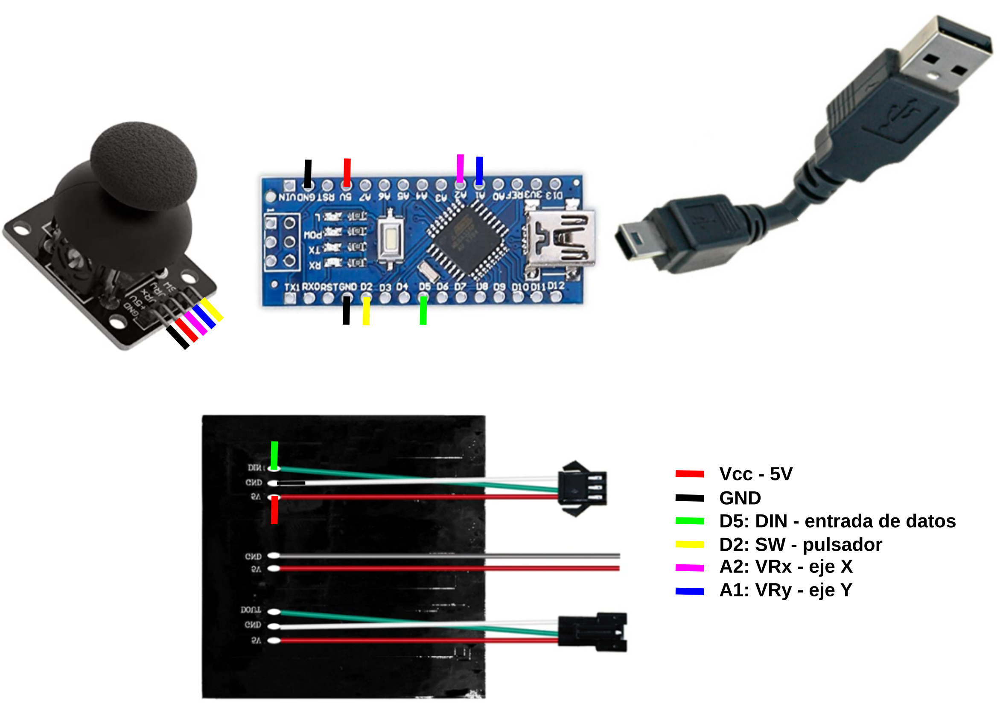

# Programa para el IDE
Se trata de una adaptación a placa nano del proyecto Snake LED 16x16 matrix game (juego arcade de la serpiente) extraido del [hub de proyectos de Arduino](https://projecthub.arduino.cc/).

Los materiales para su construcción son:

* Placa tipo nano
* Joystick genérico
* Matriz de LEDs direccionables de 16x16
* Cables para conectar los diferentes elementos

El conexionado de elementos se ha realizado soldando directamente los cables en los pines de las partes y así evitar que se suelten. El esquema básico de montaje es el de la figura siguiente:

*Esquema de conexiones*

El código del programa [serpiente](../programas/serpiente.zip), a falta de depurar, es el siguiente:

~~~
#include <FastLED.h>
// matriz
#define NUM_LEDS 256
#define DATA_PIN 5
#define Brillo 20

//joystick
#define pin_ejeX A2 // eje X
#define pin_ejeY A1 // eje Y
#define Pin_pulsador 2 // Pulsador

// variables
int snake[NUM_LEDS]; // Elementos de la matriz
int longitud = 2; // Tamaño inicial de la serpiente
int velocidad = 500; // Velocidad de la serpiente
int fila; // fila
int col; // columna
int dir = 135, nueva_dir; // direcciones
int i;
int PosX = 1, PosY; // posiciones
int f; // pixel objetivo
int rojo, verde, azul, rojo_oscuro, verde_oscuro, azul_oscuro; //colores
CRGB leds[NUM_LEDS];

void setup(){
  rojo = random(0, 255);
  verde = random(0, 255);
  azul = random(0,   255);
  rojo_oscuro = random(127, 255);
  verde_oscuro = random(127, 255);
  azul_oscuro =   random(127, 255);
  pinMode(pin_ejeX, INPUT);
  pinMode(pin_ejeY, INPUT);
  pinMode(Pin_pulsador, INPUT);
  digitalWrite(Pin_pulsador, HIGH);
  FastLED.addLeds<NEOPIXEL, DATA_PIN>(leds, NUM_LEDS);
  FastLED.setBrightness(Brillo);
   for( i=0; i<=255; i++ ){
    snake[i] = 0;
  }

  for( i=0; i<=longitud; i++ ){
    snake[i] = dir+i;
  }
    
  f = random(0, 255);
   FastLED.show();
}

int Snakedirection(int ultima, int dX, int dY){
  dX = map(dX, 0, 1000, -1, 1);
  dY = map(dY, 0, 1000, -1, 1);
  if(dX == 0 && dY == 0 && PosX != dX){
    dX = PosX;
  }
  if(dY == 0 && dX == 0 && PosY != dY){
    dY = PosY;
  }
  int nueva_dir = ultima;
  if(dX != 0 ){ // movimiento eje X
    if (fila&1 ){
        if(col == 0 && dX == 1){ nueva_dir = ultima -15;} 
        else if(col == 15 && dX == -1){ nueva_dir = ultima +15;}
        else nueva_dir = ultima + dX; 
     } else {
        if( col == 0 && dX == 1){ nueva_dir = ultima +15; }
        else if( col == 15 && dX == -1 ){ nueva_dir = ultima -15; }
        else nueva_dir = ultima - dX; 
    }
  } 
  if( dY > 0){ // movimiento hacia abajo eje Y
    if(fila == 15 && dY == -1){nueva_dir = col;}
    else if ( fila&1 ){nueva_dir = ultima + (col*2)+1;}
    else {nueva_dir = ultima + (16-col-1)+(16-col);}
   }
  if( dY < 0){ // movimiento hacia arriba eje Y
    if( fila == 0 && dY == 1){nueva_dir = 255 - col;}
    else if (fila&1 ){nueva_dir = ultima - (ultima - 16*fila) - (16 - col);} 
    else {nueva_dir = ultima - (col*2)-1;}
  }
  PosX = dX;
  PosY = dY;
  return nueva_dir;
}

int snakeMove(int snakeDirection){
  for(i=0; i<=255; i++ ){
    if( snake[i] == snakeDirection ){
      death();
     }
  }
  FastLED.clear();
  for(i=longitud; i>=1; i--){
    snake[i] = snake[i-1];
  }
  snake[0] = snakeDirection;
  for( i=0; i<=255; i++){
    if( snake[i]){
      leds[snake[i]].setRGB(rojo, verde, azul);
    }
  }
  FastLED.show();
  fila = (int)(snakeDirection/16);  // fila   
  if (fila&1 ){
    col = (fila+1) * 16 - snakeDirection - 1;
  } else {
    col = snakeDirection - fila * 16;
    }
  return snakeDirection;
}

void food(int comido ){
  if(comido == f){
    longitud++;
    f = random(0,255);
    rojo = rojo_oscuro; 
    verde = verde_oscuro; 
    azul = azul_oscuro;
    rojo_oscuro = random(0, 255);
    verde_oscuro = random(0, 255);
    azul_oscuro = random(0, 255);
    velocidad = velocidad/1.1;
  } else {
    leds[f].setRGB(rojo_oscuro, verde_oscuro, azul_oscuro);
    FastLED.show();
  }
}

void death(){
    longitud = 2;
    velocidad = 500;
    rojo = 255;
    verde = 0;
    azul = 0;  
}

void color(boolean sw){
  if(!sw){
    rojo = random(0,255);
    verde = random(0,255);
    azul = random(0,255);    
  }
}

void loop() {
  color(digitalRead(Pin_pulsador));
  nueva_dir = Snakedirection(dir, analogRead(pin_ejeX), analogRead(pin_ejeY));
  dir = snakeMove(nueva_dir);
  food(nueva_dir);
  delay(velocidad);
}
~~~
